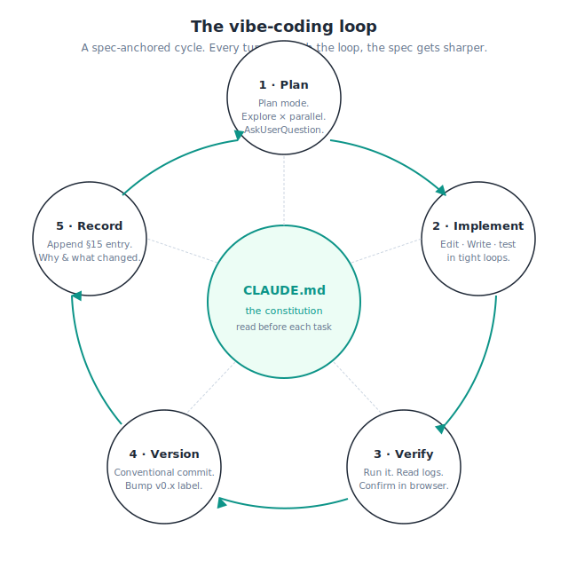
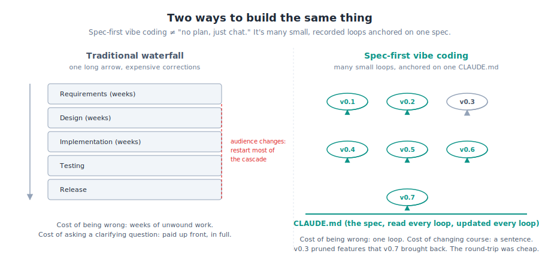
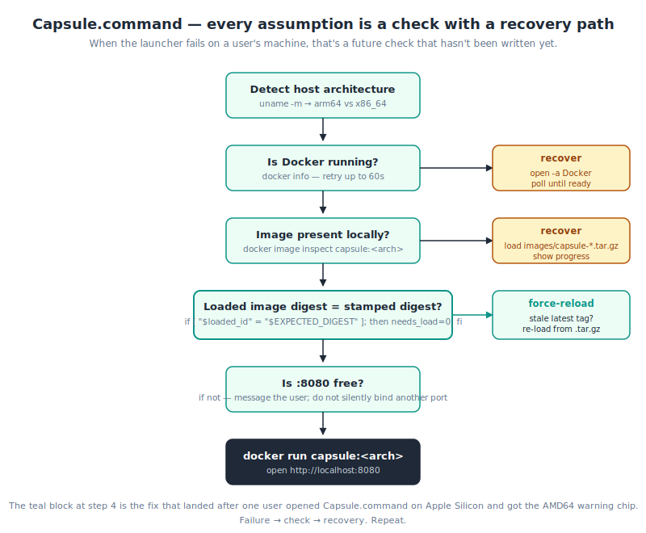
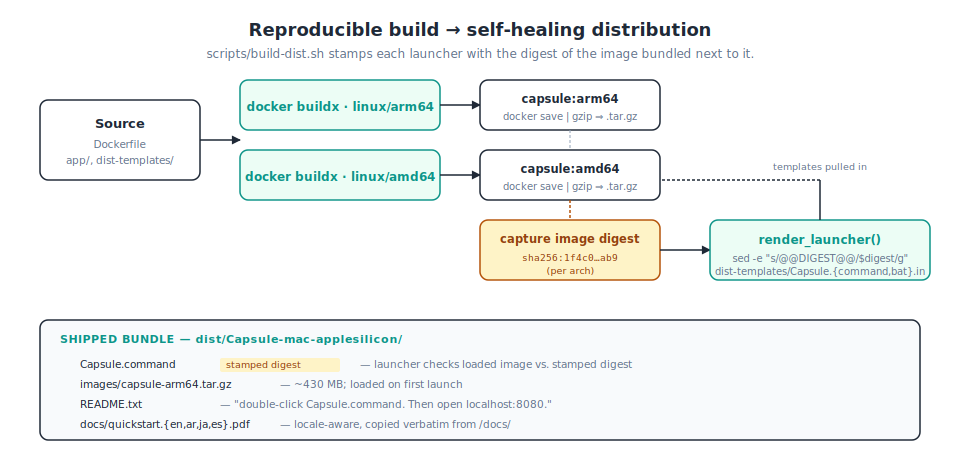
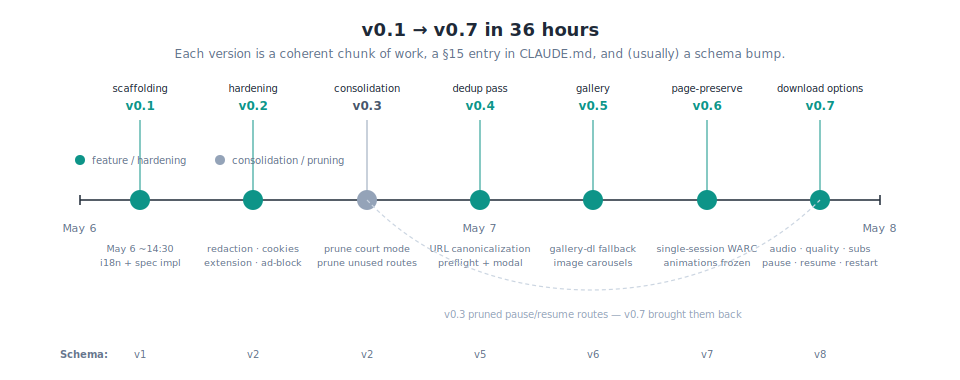

# How Capsule got built — a methodology

*A field guide to spec-first AI-assisted development, for people who don't write the code.*

---

This document is for the **decision-makers** in your organization — the
project leads, ops managers, product owners, legal advisors, and operations
people — who hear "we vibe-coded it with an AI" and want to know whether
that's a serious answer or a punchline.

Capsule is a real, shipping piece of software. It was built in roughly
36 hours of wall-clock time by one person collaborating with Claude Code.
It captures live web pages — video, images, and the surrounding context —
in a form that survives later legal scrutiny. The bar for "did this work?"
is unusually high: the artifacts have to convince a court.

The 36 hours were not improvised. Every section below is a pattern that
made the speed possible. Each pattern is shown with one concrete example
from the project, then a sentence about how to translate the pattern into
your own work.

If you only read one diagram, read [diagrams/methodology-loop.svg](diagrams/methodology-loop.svg) —
it's the whole methodology in one image.

---

## §1 — What "vibe coding" actually means here

> **One-line claim:** Vibe coding is fast iteration with an AI collaborator,
> *anchored to a written spec that the AI re-reads every turn.* It is not
> "no plan, just chat."

The phrase "vibe coding" got popular in 2025 with a different connotation:
typing a vague request into a chatbot and accepting whatever came back. That
version of vibe coding produces toy demos. It does not produce software an
investigator would stake their reputation on.

What Capsule did is different in one specific way: there is a single,
prescriptive document — `CLAUDE.md` — that is **always** loaded into every
conversation. It defines the audience, the threat model, the architecture,
the visual language, the filename rules, the integrity guarantees, and a
running log of every decision and why it was made. Every Claude turn re-reads
the parts of it that matter for that turn.

The result is a tight loop:

Each version (v0.1 → v0.7 in the diagram above) is a single small loop:
plan, implement, verify, version, record. The cost of being wrong inside
one loop is one loop. The cost of changing your mind across the whole
project is a sentence in `CLAUDE.md`.

**For your own project:** if you can write down what good looks like in
one prescriptive document, vibe coding is on the table. If you can't,
slow down and write that document first — *with* the AI's help, but
on a different day, before any code lands.

---

## §2 — The CLAUDE.md constitution

> **One-line claim:** A single, long, prescriptive Markdown file at the
> repo root is the highest-leverage artifact in an AI-assisted project.

In the Capsule repository there is one file called `CLAUDE.md`. It is
roughly 37,000 tokens — the size of a small book — and it has sixteen
numbered sections covering everything from the threat model to the
filename sanitizer rules to the audit-log schema.

CLAUDE.md does three jobs at once:

1. **Onboarding.** Every Claude session that opens in this directory
   reads it before doing anything. It is the project's institutional
   memory.
2. **Discipline.** Section 13 (titled "Working agreements for Claude
   Code") opens with: *"Read the relevant section of this file before
   starting any task. Filename work → re-read §5. UI work → §4. Integrity
   work → §7 + §8."* That instruction creates a habit: re-grounding in
   the spec at the start of every task. Mistakes that come from a stale
   mental model don't happen.
3. **Decision log.** Section 15 ("Resolved decisions") is appended to
   *as features ship*, not after. The motivation, the rejected
   alternatives, and the on-disk schema bumps live there. Future readers
   — and future Claudes — pick up instantly.

This is not a project README. The README is for users, in plain English,
with screenshots. CLAUDE.md is for the AI collaborator and for the
developer-self-of-next-week. They are different audiences and they get
different documents.

**For your own project:** start the project by writing the equivalent
document. Spend a half-day on it before writing any code. Update it as
work lands, not after.

---

## §3 — Spec-first, then iterate

> **One-line claim:** The most expensive thing AI can do is build the
> wrong thing fast. Front-load the spec.

The transcript ([transcript.md](transcript.md)) starts at 14:31 UTC on
May 6 with this sentence:

> Examine the claude.md and create an implementation plan.

Notice that CLAUDE.md already exists at this point. The session log
directory for this project does not contain the session in which CLAUDE.md
was authored — that work happened in a separate, earlier session, before
this directory existed. **The fact that we don't have the authoring
session is itself the lesson:** the spec was nailed *before* a single
line of application code was written.

Two minutes into that first implementation session, this happens
([transcript §1](transcript.md#1--the-investigators-pivot)):

> **User:** This will be a tool for investigators
>
> **Claude:** That changes the design center. "Investigator" implies the
> artifacts may need to survive scrutiny — by editors, courts, opposing
> counsel, or peer researchers — possibly years after capture. Integrity,
> provenance, and operational security become first-class, not features.

That single sentence — *"this will be a tool for investigators"* — would
have cost weeks of rework if it had landed three weeks into a traditional
build. Here it cost one minute. The Ed25519 signatures, the hash-chained
audit log, the bundled standalone verifier, the absence of telemetry —
all of it traces back to that two-minute exchange.

**For your own project:** write the spec, then audit it against your
intended audience. Have someone outside the project read it cold. The
question to answer before any code: *"who is this for, and what would
they consider proof that it worked?"*

---

## §4 — Docker as the install story

> **One-line claim:** "Install Docker Desktop, then run one command" beats
> any other install path for non-technical users.

The diagram above shows the entire runtime layout: one Docker container,
two folders mounted from the user's hard drive (one for the captured
files, one for configuration), and a single URL to open in their browser.
That's it.

Compare this to the alternative for a tool that uses headless Chromium,
yt-dlp, ffmpeg, the cryptography library, and several frontend asset
build steps:

> "Install Python 3.12. Now install Node. Now install ffmpeg. Run
> `pip install -r requirements.txt`. Now run `playwright install chromium`.
> When that fails because your Mac doesn't have the SDK, install the
> command-line tools. When the SDK install asks for an Apple ID, find
> yours …"

This is where most non-technical users give up. Docker turns the entire
install into:

1. Install Docker Desktop (one click, a free app).
2. Run one command.

The Capsule image lands at about 1.7 GB on disk and ships as a ~430 MB
gzipped bundle per processor architecture. That's bigger than a native
install would be, but the size is paid once, predictably, by every user,
and the resulting environment is **bit-identical on every machine**. For
forensic work that's not a side-benefit — it's the point. A reviewer
running the same image as the investigator gets the same outputs.

**For your own project:** if your tool has more than two real
dependencies, ship a Docker image and treat that as the canonical
distribution. Treat any non-Docker install path as "developer-only."

---

## §5 — Self-healing launchers

> **One-line claim:** Every assumption a user could trip over should be
> a pre-flight check with a recovery path.

A "Docker run" command is still a sentence the user has to copy and paste.
Capsule wraps that in a launcher — `Capsule.command` for macOS,
`Capsule.bat` for Windows — that the user double-clicks. Inside, the
launcher answers a series of questions:

Each question is a place a real user has stumbled. Each "recover" branch
is the response to a real failure report.

The most consequential check is the third one: **does the loaded image's
content digest match the digest stamped into this launcher at build
time?** That check exists because, late on May 7, a user opened
`Capsule.command` on an Apple Silicon machine and Docker Desktop showed
an "AMD64" warning chip — Docker had loaded a stale `latest` tag from a
previous experiment, masking the per-arch image the launcher had just
installed. The fix
([transcript §12](transcript.md#12--when-the-launcher-failed-on-apple-silicon))
was to add the digest comparison and force-reload the bundled tar on
mismatch.

**For your own project:** keep a list. Every time a user reports "the
launcher didn't work," ask whether that failure can become a check in
the launcher template. Distribution-side fixes pay 100× because every
user trips them.

---

## §6 — Reproducible builds

> **One-line claim:** Distribution artifacts should be regenerated by a
> single script, not assembled by hand.

The Capsule launchers are not hand-written. They are *rendered* from
templates by `scripts/build-dist.sh`, which:

1. Drives `docker buildx` for both `linux/arm64` and `linux/amd64`.
2. Saves each per-architecture image as a gzipped tar.
3. Captures each image's content digest.
4. Substitutes that digest into the launcher template.
5. Bundles the rendered launcher next to its matching tar.

The result: each ship-able bundle (`dist/Capsule-mac-applesilicon/`,
`dist/Capsule-mac-intel/`, `dist/Capsule-windows-amd64/`) contains a
launcher that *knows* which image it's supposed to be running.

**For your own project:** if assembling a release involves any
hand-written sequence of steps, put those steps in a script and treat
the script as the canonical build. The script is the only artifact that
won't drift from reality.

---

## §7 — Versioning as a practice

> **One-line claim:** Version frequently. Each version is a chunk of
> work plus a written record of why it landed.

Capsule went from v0.1 to v0.7 in 36 hours. That's roughly one version
every five hours of active work. Each version was:

- A coherent chunk of work (one feature or one hardening pass).
- A new entry in `CLAUDE.md` §15 explaining the motivation, the
  rejected alternatives, and any on-disk format changes.
- (Usually) a schema bump — see §9 below.
- (Usually) updates to the four translation bundles (English, Japanese,
  Arabic, Spanish).
- A clean state of the test suite.

The dashed curve in the diagram, between v0.3 and v0.7, is the
**round-trip story** — features that were pruned in one version and
re-added in another. We treat that as a feature, not a failure (see §11).

Frequent versioning serves AI-assisted development specifically:
**every named version is a checkpoint a future Claude can reason about**
without re-reading the entire git log. "This change is for v0.4 dedup
pass" is meaningful in a way "this change is for ticket #173" is not.

**For your own project:** name versions. Append a paragraph to your
own §15 every time you ship one. Don't wait until "the end of the
sprint" — write it while the rationale is fresh.

---

## §8 — Tamper-evident audit trail by default

> **One-line claim:** A signed, hash-chained audit log is cheap to add
> at v0.1 and impossible to retrofit honestly later.

This pattern is specific to forensic-quality tools, but the underlying
principle generalizes: *write down everything you'll wish you had a
record of, before you wish you had it.*

Capsule's `audit_log` table is append-only; each row's hash includes
the previous row's hash; tampering requires recomputing every row from
the change point forward, which is detectable. Every `meta.json` is
signed with an Ed25519 key generated on first run. The two PDFs in each
captured item folder are referenced **by hash** inside `meta.json` —
which means signing `meta.json` transitively binds them too. A bundled
~100-line standalone `verify.py` script ships with every evidence
export, so a recipient can verify integrity with no software install.

For a non-technical reader, the lesson is simpler than the cryptography:
the cost of doing this in v0.1 was a few hundred lines of Python. The
cost of retrofitting it after a year of captures would be the entire
captured library — none of the existing artifacts would have signatures.

**For your own project:** if you'll ever need to answer "what happened
when?" with confidence, the audit log goes in v0.1. Likewise per-record
integrity hashes if recipients will ever need to verify your outputs.

---

## §9 — Schema versioning, additive-only

> **One-line claim:** Old captures must stay verifiable forever. New
> captures can have new fields, but they can't break old readers.

The structured metadata file Capsule writes for each capture
(`meta.json`) has a `schema_version` field. The project went from
v1 to v8 in 36 hours — once for every major feature pass.

**Every bump was additive.** New fields appeared; no old field was
renamed or repurposed. Old `meta.json` files written under schema v3
still validate correctly. That property matters because the file is
signed: any change to its bytes invalidates the signature, and we
can't change historical signatures.

The same discipline translates anywhere data outlives the code that
wrote it: API responses consumed by external clients, data exports
that recipients have already saved, configuration files in the wild.

**For your own project:** if your data is ever read by something
you don't control, treat the format as additive-only. Every new
field is fine; no rename, no repurposing.

---

## §10 — Iteration loops with AI: four moves that pay off

> **One-line claim:** A few specific AI-collaboration moves account for
> most of the productivity gains.

### Plan mode
Before writing code on any non-trivial task, ask the AI to explore the
codebase first, then write a plan to a file. Read the plan. Approve it.
*Then* let the code happen. This document was created in plan mode —
the plan lives at
`/Users/brian/.claude/plans/create-a-transcript-md-reproducing-iterative-umbrella.md`
and was approved verbatim before any deliverable was written.

### Parallel exploration agents
For research questions that span multiple parts of a codebase, run
several read-only Explore subagents in parallel from a single message.
The transcript's preparation used three parallel Explore agents to map
git history, find self-healing patterns, and audit existing process
docs — all in one round-trip. That's a 3× wall-clock speedup with no
tradeoff.

### Clarifying questions before pruning
On May 6 at 23:58, the user said *"remove the court setting i only
want the simple UI."* Claude paused, opened a clarifying question,
and confirmed the intent before doing anything destructive
([transcript §7](transcript.md#7--remove-the-court-setting)). That
30-second clarification prevented a multi-day cleanup. If the AI
seems poised to make a change you'd regret, ask it to clarify first.
The pause is free.

### Memory and feedback
Persistent memory means lessons learned don't have to be re-taught
session after session. When the user said *"This will be a tool for
investigators"* (transcript §1), Claude saved that to a memory file
before re-planning. Every subsequent session in the project picked
up that audience context automatically.

**For your own project:** these aren't AI features in some
abstract sense. They're concrete moves you can demand from an
AI collaborator on day one.

---

## §11 — What gets pruned, comes back

> **One-line claim:** Be willing to be wrong. Add the feature back when
> the next version needs it. Don't keep features alive on principle.

In v0.3 ("Simple-view consolidation"), Capsule pruned a number of HTTP
routes that the simplified UI didn't need: pause/resume/cancel on jobs,
the case-detail mutation endpoints, and others. The reasoning was
sound: every endpoint is a maintenance cost, a security surface, and a
documentation burden.

In v0.7 ("Download options + reliability"), most of those routes came
back, because the new per-job toolbar in the UI needed them.

A traditional reading of this story is: the v0.3 pruning was a mistake.
A better reading is: **the round-trip was nearly free.** The git
history of v0.3 is well-documented. The pause/resume orchestrator
methods were preserved internally even when the HTTP routes were gone
(see CLAUDE.md §15, "Simple-view consolidation v0.3"). Bringing them
back as routes was a few hundred lines.

The reason the round-trip was cheap is the discipline elsewhere in the
project: the audit log, the signed metadata, the additive schema. If
the project had baked a permanent assumption ("we never expose
pause/resume"), the round-trip would have meant data-format breaks. It
didn't, because the discipline didn't allow it.

**For your own project:** prune with confidence when the current
need is clear. Bring it back when the next need surfaces. Discipline
on data formats and decision logs is what makes pruning safe.

---

## §12 — Best-practices checklist

A scannable summary you can take to your own project. None of these
require a developer to evaluate. They're organizational practices.

### Specification

- [ ] One prescriptive Markdown file at the repo root (call it
      `CLAUDE.md` or `AGENTS.md`). Numbered sections. Audience: the AI
      collaborator and the developer of next month.
- [ ] First section: who is this for and what counts as proof it
      worked.
- [ ] A "Resolved decisions" section that gets a paragraph appended
      every time a feature ships. Written *while* the rationale is
      fresh.

### Distribution

- [ ] One Docker image. One `docker run` command. Two bind-mounts
      maximum (one for outputs, one for configuration).
- [ ] A self-healing launcher per OS, generated from a template at
      build time, stamped with the digest of the image it ships next
      to.
- [ ] A reproducible build script. Distribution should never be a
      manual sequence of steps.

### Data

- [ ] Schema versioning, additive-only. New fields are fine; renames
      and repurposes are not.
- [ ] Per-record integrity (hash + signature) if recipients will ever
      need to verify outputs without your tooling.
- [ ] An append-only audit log of meaningful operations. Hash-chain it
      if your audience cares about tamper detection.

### Process

- [ ] Plan mode first. The AI writes a plan file you read before any
      code lands.
- [ ] Parallel exploration agents for any multi-part research
      question.
- [ ] Clarifying questions before destructive changes, every time.
- [ ] Frequent versions. v0.1 → v0.2 → v0.3 in days, not months.
- [ ] A §15 entry per version, with motivation and rationale, written
      *while* the rationale is fresh.

### Transparency

- [ ] Session logs preserved. Curate the interesting ones for new
      teammates.
- [ ] Redaction policy documented before sharing any session content.
- [ ] Cross-reference: code commits cite §15 entries; §15 entries
      cite commit hashes.

---

## Closing

The Capsule project demonstrates that AI-assisted development can hit
a high bar — forensic-quality artifacts, cross-platform distribution,
multilingual UI including a right-to-left script, signed evidence
exports — *if* the discipline is right. The discipline is:

- **One spec, read every turn, updated every turn.**
- **Many short loops, each one closing with a written record of why.**
- **Pre-flight checks for every assumption a user could trip over.**
- **Data formats that survive future changes by design.**

Everything else is the AI's problem to solve — and increasingly, it
will.

---

### Continuing reading

- **[transcript.md](transcript.md)** — twelve real exchanges from the
  build, with editor's notes.
- **[CLAUDE.md](../../CLAUDE.md)** — the project's constitution. Sixteen
  sections, ~37k tokens. The §15 decision log is the closest thing to
  this methodology that exists in the project itself.
- **[scripts/extract_session_excerpts.py](../../scripts/extract_session_excerpts.py)**
  — the reproducible extractor used to build [transcript.md](transcript.md). Run it
  to regenerate the chronological session index any future reader can
  audit against the JSONL files.
