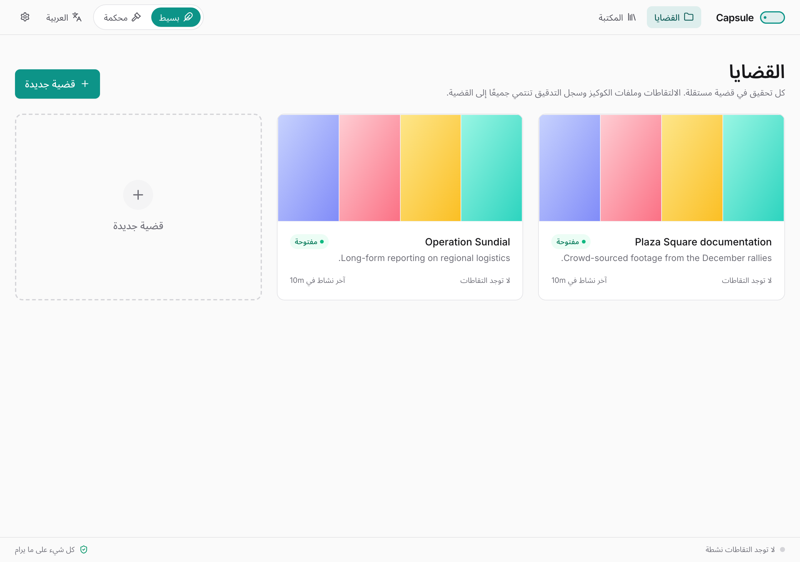

# دليل البدء السريع — Capsule

*وثّق الويب بالدليل — في خمس دقائق.*

يُتيح Capsule للباحثين والمحقّقين حفظ صفحات الويب ومقاطع الفيديو والمنشورات بطريقة تصمد أمام التدقيق لاحقًا. كلّ التقاط يحفظ الصفحة كما هي، ويُنزّل أي وسائط فيها، ويُوقّع النتيجة كي يستطيع المتلقّي التأكّد لاحقًا أن شيئًا لم يتغيّر.

يأخذك هذا الدليل من الصفر إلى أوّل عملية التقاط لك.

---

## ما الذي تحتاج إليه

- جهاز يعمل بنظام **macOS 12 أو أحدث** أو **Windows 10/11**.
- **Docker Desktop** (مجاني). يعمل Capsule داخله، فلا حاجة لتثبيت Python أو متصفّح أو yt-dlp بنفسك.
- نحو **2 جيجابايت** من المساحة الحرّة عند أوّل تنزيل.

> Docker Desktop أداة مجانية تتيح تشغيل Capsule على جهازك دون الحاجة إلى تثبيت أي شيء آخر. حمّلها من <https://www.docker.com/products/docker-desktop>.

---

## التثبيت بنقرة واحدة

1. ثبّت Docker Desktop وافتحه مرّة واحدة. انتظر حتى تظهر أيقونته في شريط القوائم (macOS) أو علبة النظام (Windows) دلالةً على أنه يعمل.
2. **انقر مرتين** على المُشغِّل الموجود في مجلّد Capsule:
    - macOS: `Capsule.command`
    - Windows: `Capsule.bat`
3. في المرّة الأولى يُنزّل المُشغِّل تطبيق Capsule (نحو 2 جيجابايت). بعد ذلك يستغرق التشغيل ثلاث ثوانٍ تقريبًا.
4. يُفتح المتصفّح على لوحة القضايا.

هذا كل شيء. لا طرفية ولا أوامر.

---

## أوّل عملية التقاط لك

1. انقر **+ قضية جديدة**. أعطها اسمًا قصيرًا يسهل تذكّره. القضية هي تحقيق واحد — مجلّد لكلّ ما تجمعه حول موضوع معيّن.
2. داخل القضية، انقر **التقط رابطًا**.
3. ألصق أي رابط — فيديو أو تغريدة أو مقالًا. اضغط **التقاط**.
4. يقوم Capsule بأربعة أشياء بالترتيب: يلتقط صورة الصفحة، يُنزّل أي وسائط، يحسب التجزئة لكلّ ملف، ثمّ يُوقّع النتيجة. ترى كل خطوة تُضيء.
5. عند الانتهاء يظهر العنصر في مكتبتك بشارة سلامة خضراء.

لكلّ رابط يحفظ Capsule:

- لقطة كاملة للصفحة،
- نسخة مستقلّة من الصفحة بصيغة MHTML،
- أرشيف WARC للصفحة وكلّ مواردها الفرعية،
- الفيديو أو الصوت إن وُجد،
- ملف JSON جانبي بكلّ التفاصيل التقنية،
- بصمات MD5 و SHA-256 لكلّ ملف،
- توقيعًا يستطيع التحقّق منه أي طرف آخر.

حتى الصفحات التي لا تحتوي على وسائط، تُحفظ لقطتها — فلديك دائمًا شيء.

---

## أين تذهب الملفات

يحفظ Capsule التقاطاتك في مجلّد يمكنك تصفّحه كأي مجلّد آخر:

- macOS: `~/Documents/Capsule/`
- Windows: `%USERPROFILE%\Documents\Capsule\`

كلّ قضية في مجلّد فرعي خاص بها. ملفات الوسائط في جذر القضية، أمّا الملفات الجانبية الأكثر تفصيلًا (لقطات الصفحة، التجزئات، التواقيع) فتعيش في مجلّد فرعي اسمه `sidecars/`.

---

## الإيقاف والتشغيل من جديد

- **لإيقاف التطبيق:** أغلق Docker Desktop، أو نفّذ `docker stop capsule` في الطرفية.
- **لتشغيله مجدّدًا:** انقر مرتين على المُشغِّل.
- **لا يعمل Capsule تلقائيًا** عند تشغيل جهازك. أنت من يُشغّله عندما تحتاجه، ويبقى بعيدًا عن طريقك حين لا تحتاجه.

---

## الخطوات التالية

- أداة التنزيل هي كامل الواجهة في الإصدار الأول: ألصق رابطًا، تابع شريط الالتقاط رباعي المراحل، ثم اعثر على النتيجة في شبكة «آخر الالتقاطات».
- افتح **الإعدادات** (ترس في الترويسة) لتغيير اللغة، عرض بصمة مفتاح التوقيع، اقتران إضافة المتصفح، أو التحقق من تحديثات yt-dlp.
- البيانات الجنائية — مجلدات القضايا، سجل التدقيق المسلسل بالتجزئة، حِزَم تصدير الأدلّة الموقَّعة — ما زالت تُنتَج لكل التقاط، وتعيش على القرص في `~/Documents/Capsule/quick-captures/` وعبر الـ API. راجع **دليل المستخدم** لتسليم الأدلّة والتحقق منها.
- قائمة **Help** في Docker Desktop هي صديقتك لأي مشكلة متعلّقة بـ Docker.

عند حدوث خطأ، يحتوي كلّ تنبيه على زر «إظهار التفاصيل التقنية» — انسخ النص وألصقه في تقرير الخطأ ليتمكّن فريق الدعم من المساعدة.
