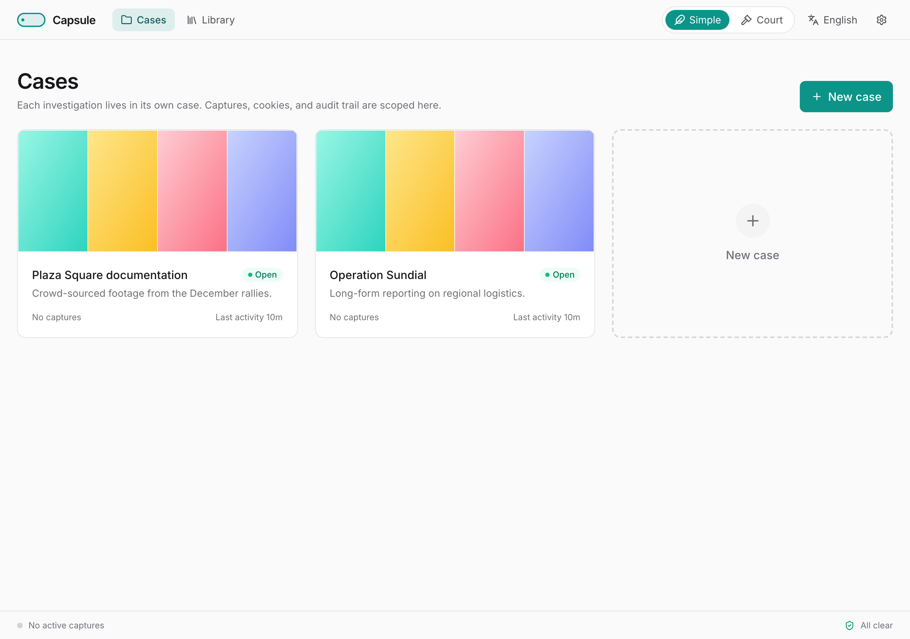

# Inicio rápido de Capsule

*Captura la web, con pruebas — en cinco minutos.*

Capsule permite a los investigadores guardar páginas web, videos y publicaciones de una forma que resista el escrutinio posterior. Cada captura conserva la página exactamente como estaba, descarga los medios si los hay, y firma el resultado para que un destinatario pueda confirmar más adelante que nada cambió.

Esta guía te lleva desde cero hasta tu primera captura.

---

## Lo que necesitas

- Una computadora con **macOS 12+** o **Windows 10/11**.
- **Docker Desktop** (gratuito). Capsule corre dentro de Docker, así que no necesitas instalar Python, navegadores ni yt-dlp por tu cuenta.
- Alrededor de **2 GB de espacio libre** en disco para la primera descarga.

> Docker Desktop es una herramienta gratuita que permite que Capsule funcione en tu computadora sin que tengas que instalar nada más. Descárgala en <https://www.docker.com/products/docker-desktop>.

---

## Instalación con un clic

1. Instala Docker Desktop y ábrelo una vez. Espera a que el ícono en la barra de menús (macOS) o en la bandeja del sistema (Windows) muestre que está en ejecución.
2. **Haz doble clic** en el lanzador dentro de la carpeta de Capsule:
    - macOS: `Capsule.command`
    - Windows: `Capsule.bat`
3. La primera vez, el lanzador descarga Capsule (~2 GB). Después de eso tarda alrededor de tres segundos.
4. Tu navegador se abre en el panel de Casos.

Eso es todo. Sin terminal, sin comandos.

---

## Tu primera captura

1. Haz clic en **+ Nuevo caso**. Asígnale un nombre corto y memorable. Un caso es una sola investigación — una carpeta para todo lo que recopiles sobre un tema.
2. Dentro del caso, haz clic en **Capturar un enlace**.
3. Pega cualquier URL — un video, un tweet, un artículo de noticias. Presiona **Capturar**.
4. Capsule hace cuatro cosas, en orden: toma una instantánea de la página, descarga cualquier medio, calcula los hashes de cada archivo y firma el resultado. Verás cada paso encenderse.
5. Cuando termina, el elemento aparece en tu biblioteca con una insignia verde de integridad.

Para cada URL Capsule guarda:

- Una captura de pantalla de página completa,
- Una instantánea autocontenida de la página (MHTML),
- Un archivo WARC con la página y todos los recursos que cargó,
- El video o el audio si hay alguno,
- Un archivo JSON adjunto con todos los detalles técnicos,
- Hashes MD5 y SHA-256 de cada archivo,
- Una firma que tú y otros pueden verificar.

Incluso en páginas sin medios, la instantánea de la página queda preservada — así que siempre tienes algo.

---

## Dónde se guardan las cosas

Capsule guarda tus capturas en una carpeta que puedes navegar como cualquier otra:

- macOS: `~/Documents/Capsule/`
- Windows: `%USERPROFILE%\Documents\Capsule\`

Cada caso es su propia subcarpeta. Los archivos de medios viven en la raíz del caso; los sidecars más ruidosos (instantáneas de página, hashes, firmas) viven en una subcarpeta `sidecars/`.

---

## Detener y reiniciar

- **Para detener la aplicación:** cierra Docker Desktop, o ejecuta `docker stop capsule` en una terminal.
- **Para iniciarla de nuevo:** haz doble clic en el lanzador.
- Capsule **no se inicia automáticamente** cuando enciendes la computadora. Tú la inicias cuando quieres usarla; el resto del tiempo se mantiene fuera del camino.

---

## Próximos pasos

- El descargador es toda la interfaz en la versión 1: pega un enlace, observa el progreso de cuatro fases y encuentra el resultado en la cuadrícula de Capturas recientes.
- Abre **Ajustes** (el engranaje en el encabezado) para cambiar el idioma, ver la huella de tu clave de firma, vincular la extensión del navegador o buscar actualizaciones de yt-dlp.
- Los datos forenses — carpetas agrupadas por caso, el registro de auditoría encadenado por hash, paquetes firmados de exportación de evidencia — se siguen produciendo para cada captura. Viven en disco bajo `~/Documents/Capsule/quick-captures/` y a través de la API. Consulta la **Guía del usuario** para la entrega y verificación de evidencia.
- El menú de **Ayuda** en Docker Desktop es tu aliado para cualquier problema relacionado con Docker.

Si algo sale mal, cada error tiene un botón "Mostrar detalles técnicos" — copia ese texto en un reporte de error y podremos ayudar.
