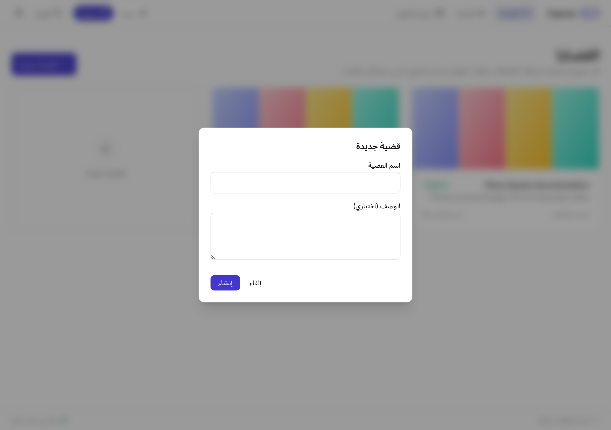
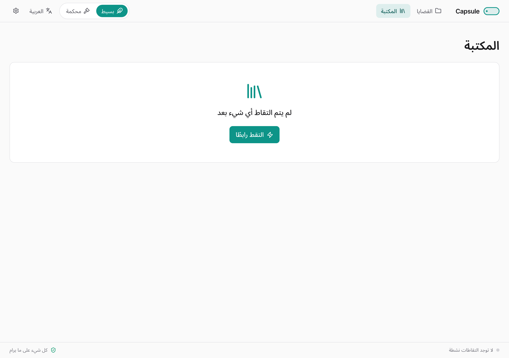
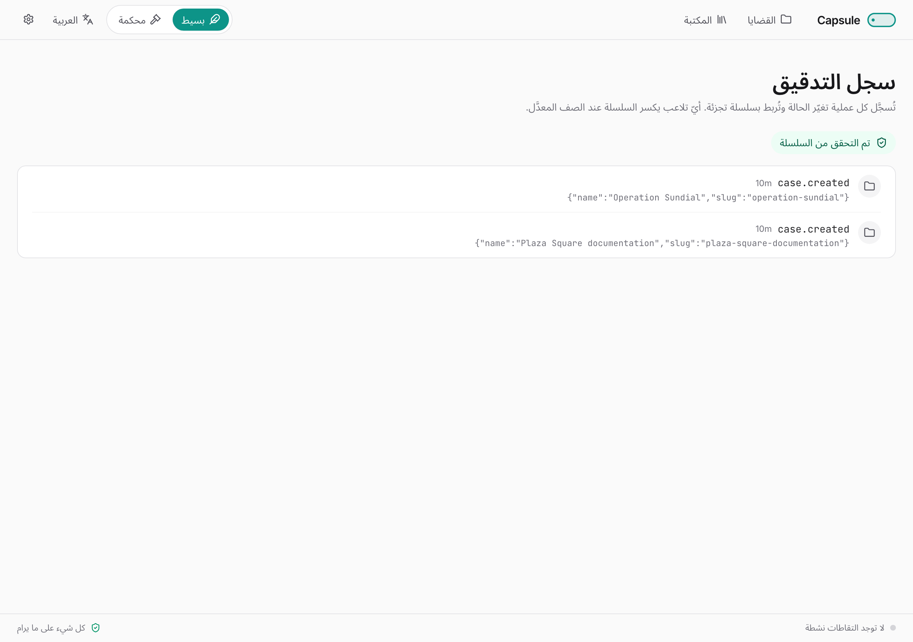
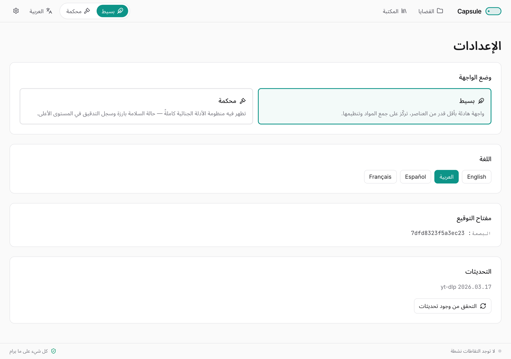

# دليل مستخدم Capsule

*وثّق الويب بالدليل.*

يمرّ هذا الدليل على كلّ ميزة في Capsule — ماذا تفعل ولماذا تفعلها وكيف تستخدمها بكفاءة. إن كنت تحتاج فقط إلى البدء، راجع **دليل البدء السريع**.

---

## ١. لمَن وُضع Capsule

Capsule مُوجَّه إلى المحقّقين — الباحثين والصحفيّين والمحامين والعاملين في الإثبات القضائي — الذين يحتاجون إلى التقاط المواد الإلكترونية بطريقة تصمد أمام التدقيق لاحقًا. يُجيب التطبيق على أربعة أسئلة لكلّ عنصر تحفظه:

١. **من أين جاء؟** الرابط الأصلي، سلسلة التحويلات، ترويسات الاستجابة، المنصّة.
٢. **متى تمّ الالتقاط؟** ختم زمني بالتوقيت العالمي UTC، على سجل تدقيق مقاوم للتلاعب.
٣. **هل المادة سليمة؟** بصمات MD5 و SHA-256 لكلّ ملف، مع توقيع تشفيري.
٤. **مَن قام بالالتقاط؟** بصمة مفتاح التوقيع الخاصّ بك.

لا يحلّ Capsule محلّ التعامل الحذِر بالأدلّة، لكنه يُزيل أكثر الأسباب شيوعًا للطعن في الالتقاطات: مصدر مجهول، توقيت غير واضح، غياب التحقّق من السلامة، غياب التوقيع.

---

## ٢. ما تُظهره الواجهة في الإصدار الأول

التطبيق كله، في الإصدار الأول، شاشةُ **تنزيل** واحدة، إضافةً إلى لوحة **الإعدادات**. ألصق رابطًا (أو قائمة)، تابع شريط التقدّم رباعي المراحل، ثم اعثر على النتيجة في شبكة «آخر الالتقاطات» تحت النموذج. هذا كلّ ما في الواجهة.

أمّا الآلية الجنائية — مجلّدات القضايا، الكوكيز لكلّ قضية، سجل التدقيق المسلسل بالتجزئة، حِزَم تصدير الأدلّة الموقَّعة — فما زالت تعمل لكلّ التقاط. تَصِل إليها عبر نظام الملفات للمضيف (`~/Documents/Capsule/`) وعبر الـ API. الفصول ٣–٧ أدناه تشرح **ما يوجد على القرص** و**كيف تستخدم الـ API** عند الحاجة.

---

## ٣. القضايا

القضية تحقيق واحد، تملك التقاطاتها وملفات الكوكيز الخاصّة بها وحصّتها من سجل التدقيق. على القرص، كلّ قضية في مجلّد خاص بها تحت `~/Documents/Capsule/{slug-القضية}/`.

### إنشاء قضية

انقر **+ قضية جديدة** على لوحة القضايا. أعطها اسمًا — يُولَّد الـ slug المُستخدم على القرص من الاسم بصيغة آمنة لكلّ نظام ملفات.



### العمل داخل قضية

للقضية أربعة تبويبات:

- **الالتقاطات** — كلّ عنصر مُحفوظ في هذه القضية.
- **ملفات الكوكيز** — ملفات الكوكيز الخاصّة بالقضية للمواقع التي تتطلّب تسجيل الدخول (راجع §٦).
- **التدقيق** — مدخلات سجل التدقيق الخاصّة بالقضية.
- **الإعدادات** — تفضيلات خاصّة بالقضية (الاحتفاظ بالأجزاء الخام، تنزيل الصور المصغّرة مسبقًا).

### الأرشفة وإعادة الفتح

تعرض قائمة النقاط الثلاث **أرشفة القضية** و**تصدير الأدلّة**. تبقى القضايا المؤرشفة قابلةً للتصفّح والتحقّق؛ يتغيّر التركيز البصري فقط. يمكنك إعادة فتحها في أي وقت.

---

## ٤. التقاط رابط

افتح قضية وانقر **التقط رابطًا**. ألصق أي رابط.

ما يفعله Capsule بالترتيب:

١. **تصنيف الرابط.** يحلّ التحويلات، يحدّد المنصّة (يوتيوب، تويتر/X، تيك توك، …)، ويتحقّق ممّا إذا كانت القضية تملك ملفات كوكيز للنطاق.
٢. **التقاط الصفحة.** لقطة كاملة للصفحة، نسخة MHTML مستقلّة، وأرشيف WARC للصفحة وكلّ مواردها الفرعية.
٣. **تنزيل الوسائط** إن وُجدت — فيديو أو صوت أو صورة — باستخدام yt-dlp في الخلفية.
٤. **التجزئة والتوقيع.** يحصل كلّ ملف على بصمتي MD5 و SHA-256، ثمّ يُوقَّع سجل البيانات الوصفية بمفتاح Ed25519 الخاصّ بك.

ترى أربع أيقونات تُضيء مع اكتمال كلّ مرحلة: كرة أرضية (الصفحة)، سحابة تنزيل (الوسائط)، علامة التجزئة (التحقق)، درع به علامة (التوقيع).

### أنواع الالتقاط

كلّ رابط يُنتج حزمة لقطة. يحدّد إنتاجه ملف وسائط أم لا نوع الالتقاط:

- **وسائط وصفحة** — احتوى الرابط على فيديو أو صوت أو صورة استطاع Capsule تنزيلها.
- **صفحة فقط** — لا توجد وسائط قابلة للاستخراج. تُحفظ لقطة الصفحة وتُجزّأ وتُوقَّع رغم ذلك.

فشل تنزيل الوسائط **لا يعني** فشل الالتقاط. حزمة لقطة الصفحة تُحفظ.

---

## ٥. حزمة الالتقاط

لكلّ عنصر، يكتب Capsule مجلّد ملفات جانبية بجوار ملف الوسائط:

```
{slug-القضية}/
├── youtube__veritasium__The_Most_Stubbornly_…__abc123XYZ.mp4
└── sidecars/
    └── youtube__veritasium__The_Most_Stubbornly_…__abc123XYZ/
        ├── …meta.json            # سجل البيانات الوصفية القانوني
        ├── …meta.json.sig        # توقيع Ed25519 المنفصل
        ├── …checksums.txt        # MD5 و SHA-256 لكل ناتج
        ├── …page.mhtml           # نسخة الصفحة المستقلّة
        ├── …page.png             # اللقطة الكاملة للصفحة
        ├── …page.warc.gz         # أرشيف WARC
        ├── …info.json            # تفريغ yt-dlp الكامل للبيانات الوصفية
        ├── …description.txt      # وصف الفيديو (عند توفّره)
        └── …thumbnail.jpg        # الصورة المصغّرة (عند توفّرها)
```

نمط اسم الملف القانوني هو `{المنصّة}__{صاحب التحميل}__{العنوان}__{التاريخ}__{معرّف الفيديو}.{الامتداد}`، بعد تنقية الاسم ليكون نقّالًا بين الأنظمة (تنطبق قواعد NTFS في Windows على ملفات Mac أيضًا، كي تتنقّل المكتبة بين الأجهزة دون مفاجآت).

العنوان والرابط الأصليان دون اقتطاع موجودان في `meta.json` — لا يُفقَدان أبدًا.

---

## ٦. ملفات الكوكيز والالتقاط الموثّق

بعض المحتوى لا يظهر إلّا بعد تسجيل الدخول: حسابات خاصّة، مقاطع فيديو محصورة عُمريًا، مقالات خلف اشتراك، منتديات للأعضاء فقط. يدعم Capsule هذا عبر ملفات كوكيز خاصّة بكلّ قضية.

### رفع ملفات الكوكيز

١. افتح القضية ← تبويب **ملفات الكوكيز**.
٢. انقر **رفع cookies.txt**. استخدم إضافة متصفّح لتصدير ملفات الكوكيز من الموقع الذي تريد التقاطه، ثمّ ارفع الملف المُصدَّر.
٣. يعرض Capsule النطاقات وتواريخ انتهاء الصلاحية كي تعرف أيّ المواقع مغطّاة. **لا تُعرض قيم ملفات الكوكيز نفسها أبدًا، ولا تُسجَّل، ولا تُدرَج في تصدير الأدلّة.**

### كيف تُستخدم

عند لصق رابط نطاقه يطابق ملفات الكوكيز التي رفعتها، ترى شارة **مُسجَّل الدخول إلى {النطاق}** على معاينة الالتقاط. تُمرَّر ملفات الكوكيز إلى أداة لقطة الصفحة وأداة تنزيل الوسائط معًا، فتأتي اللقطة والوسائط من الجلسة الموثّقة نفسها.

يربط Capsule ملفات الكوكيز تلقائيًا بكلّ منصّات التواصل الاجتماعي الرئيسية التي يتعرّف عليها.

---

## ٧. المكتبة

تعرض المكتبة الالتقاطات عبر كلّ القضايا في شبكة تُهيمن عليها الصور المصغّرة. تُتيح تصفية النتائج حسب القضية أو المنصّة أو تاريخ الالتقاط أو حالة السلامة أو نوع الالتقاط.



### الإجراءات على كلّ عنصر

تُتيح قائمة النقاط الثلاث على كلّ بطاقة:

- **فتح المجلّد** في مدير الملفات.
- **عرض التفاصيل** — تبويب الوسائط، تبويب لقطة الصفحة، قائمة الملفات الجانبية، مدخلات التدقيق.
- **التحقق من السلامة** — يُعيد حساب التجزئات لكلّ ملف ويُعيد فحص التوقيع. الشارة الخضراء تعني تطابقًا تامًا، أمّا الحمراء فتُظهر الفرق.
- **إعادة الالتقاط** — يُشغّل الرابط مجدّدًا كمدخل شقيق.
- **النقل إلى قضية أخرى** — يحفظ تاريخ التدقيق.
- **الحذف** — حذف ناعم من قاعدة البيانات؛ تبقى الملفات على القرص حتى تحذفها يدويًا.

---

## ٨. التحقق من السلامة

كلّ ناتج يُجزَّأ، وسجل البيانات الوصفية يُوقَّع. يمكنك إعادة الفحص في أي وقت:

- **عنصر واحد:** الإجراء **التحقق من السلامة** على بطاقة العنصر أو صفحة تفاصيله.
- **المكتبة كاملةً:** الإجراء الجماعي **التحقق من الكلّ** في إعدادات المكتبة.
- **حزمة استلمتها:** كلّ تصدير أدلّة يأتي مع سكربت مستقلّ `verify.py`.

عند فشل التحقّق يحصل المُستخدم على الفرق الفعلي: أيّ ملف اختلفت بصمته، البصمة المتوقَّعة، البصمة المرصودة، وفشل التوقيع (إن وُجد).

---

## ٩. سجل التدقيق

كلّ عملية تُغيّر الحالة — إنشاء قضية، بدء التقاط، التقاط صفحة، تنزيل وسائط، إنشاء توقيع، التحقق من عنصر، تصدير قضية — تُسجَّل في سجل تتابعي يُربط بسلسلة تجزئة ولا يقبل التعديل.



كلّ مدخل يحوي بصمة المدخل السابق. إن عُدِّل صف، تنكسر السلسلة عنده وتُظهر الواجهة المكان بدقّة.

سجل التدقيق غير ظاهر في واجهة الإصدار الأول. هو يُكتب دائمًا، ويمكن الوصول إليه عبر `GET /api/audit` وفي ملف `audit_log.json` داخل كلّ حزمة لتصدير الأدلّة.

---

## ١٠. تصدير الأدلّة

عندما تكون جاهزًا للتسليم، انقر **تصدير الأدلّة** على شاشة تفاصيل القضية. يقدّم المعالج:

١. **اختيار المحتويات** — افتراضيًا كلّ ما في القضية. يمكنك تضييق النطاق حسب التاريخ أو نوع الالتقاط.
٢. **اختيار الوجهة** — أي مجلّد على جهازك.
٣. **المراجعة والتأكيد** — يُنتج Capsule ملف zip مُوقَّعًا وتقرير PDF.

تحتوي الحزمة على:

- كلّ ملف ملتقَط مع ملفاته الجانبية،
- ملف `manifest.json` يُدرج كلّ ملف بدوره وحجمه وبصمتي MD5 و SHA-256،
- `manifest.sig` — توقيع Ed25519 المنفصل لبيان المحتويات،
- `public_key.pem` — كي يستطيع المتلقّي التحقّق،
- **تقرير PDF** للقضية مُتاح بلغات متعدّدة (يدعم العربية بترتيب من اليمين إلى اليسار)،
- ملف JSON كامل لسجل التدقيق الخاص بهذه القضية،
- `verify.py` — سكربت Python مستقلّ يستطيع المتلقّي تشغيله دون أي تبعيّات سوى مكتبة `cryptography`.

يُشغّل المتلقّي `python verify.py path/to/bundle/` فيحصل على تقرير PASS/FAIL. لا يحتاج إلى تثبيت Capsule.

---

## ١١. التحديثات

لا يُحدّث Capsule نفسه تلقائيًا، ولا يستفسر صامتًا عن التحديثات. أنت تقرّر متى.

في **الإعدادات ← التحديثات**، انقر **التحقق من وجود تحديثات**. يُجري Capsule استعلامًا واحدًا لواجهة GitHub ويُخبرك بما هو متاح. إن وافقت، يُثبَّت إصدار yt-dlp الجديد داخل الحاوية، ويُسجَّل التغيير في سجل التدقيق.

إن فشل التقاط بخطأ من النوع الذي يدلّ عادةً على قِدَم yt-dlp، تعرض بطاقة الفشل زرّ **التحقق من تحديثات yt-dlp** السياقي.

---

## ١٢. الإعدادات



- **اللغة** — العربية، الإنجليزية، الإسبانية، الفرنسية. التبديل في أي وقت دون إعادة تحميل.
- **مفتاح التوقيع** — اعرض بصمتك، استورد زوج مفاتيح موجودًا، أو صدّر الزوج الحالي. تُطبَّق المفاتيح المستوردة على الالتقاطات اللاحقة فقط؛ يحتفظ كلّ عنصر سابق بتوقيعه الأصلي.
- **التحديثات** — تحقّق يدوي، راجع §١١.

---

## ١٣. حلّ المشكلات

- **يقول المُشغِّل إنّ Docker لا يعمل.** افتح Docker Desktop من Applications (macOS) أو قائمة Start (Windows) وانتظر اكتمال تشغيله.
- **يقول المُشغِّل إنّ المنفذ 8080 مُستخدم.** أوقف ما يستخدم المنفذ 8080، أو عدّل المُشغِّل لاستخدام منفذ آخر (`-p 9090:8080`).
- **فشل التقاط ما.** انقر **إظهار التفاصيل التقنية** على بطاقة الخطأ. تتضمّن الرابط، الختم الزمني، إصدارات كلّ الأدوات، ومخرجات الخطأ كاملةً — ألصقها في تقرير الخطأ.
- **يحجبني الموقع.** جرّب رفع ملفات الكوكيز للموقع (راجع §٦) ثمّ أعِد الالتقاط.
- **يحدّ الموقع من معدّل طلباتي.** انتظر بضع دقائق ثمّ انقر **إعادة المحاولة**.

---

## ١٤. لمتلقّي حزم الأدلّة

إن أرسل إليك أحدهم حزمة Capsule، يمكنك التحقّق من كلّ شيء دون تثبيت Capsule:

١. فُكّ ضغط الحزمة.
٢. افتح طرفية في مجلّد الحزمة.
٣. نفّذ `python verify.py .`
٤. اقرأ التقرير. PASS تعني أن كلّ ملف يطابق بيان المحتويات، وكلّ توقيع صالح، وسلسلة سجل التدقيق سليمة. FAIL تُحدّد بدقّة ما لا يتطابق.

تقرير PDF المُوقَّع داخل الحزمة قابل للقراءة وحسّاس للّغة — قارئ العربية يحصل على تقرير من اليمين إلى اليسار، وقارئ الإنجليزية يحصل على المحتوى نفسه من اليسار إلى اليمين.
