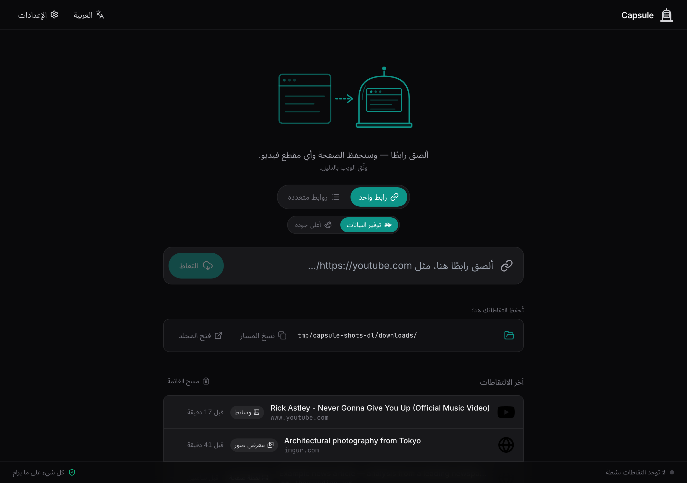
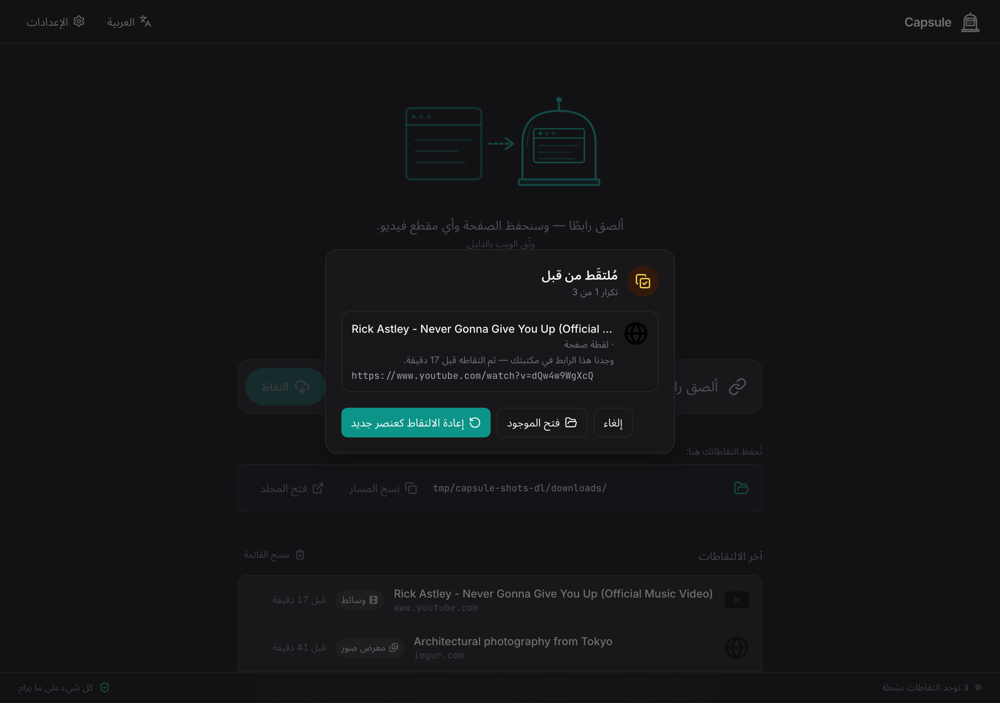
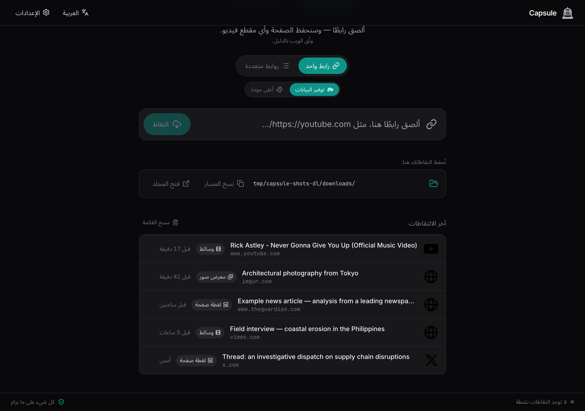
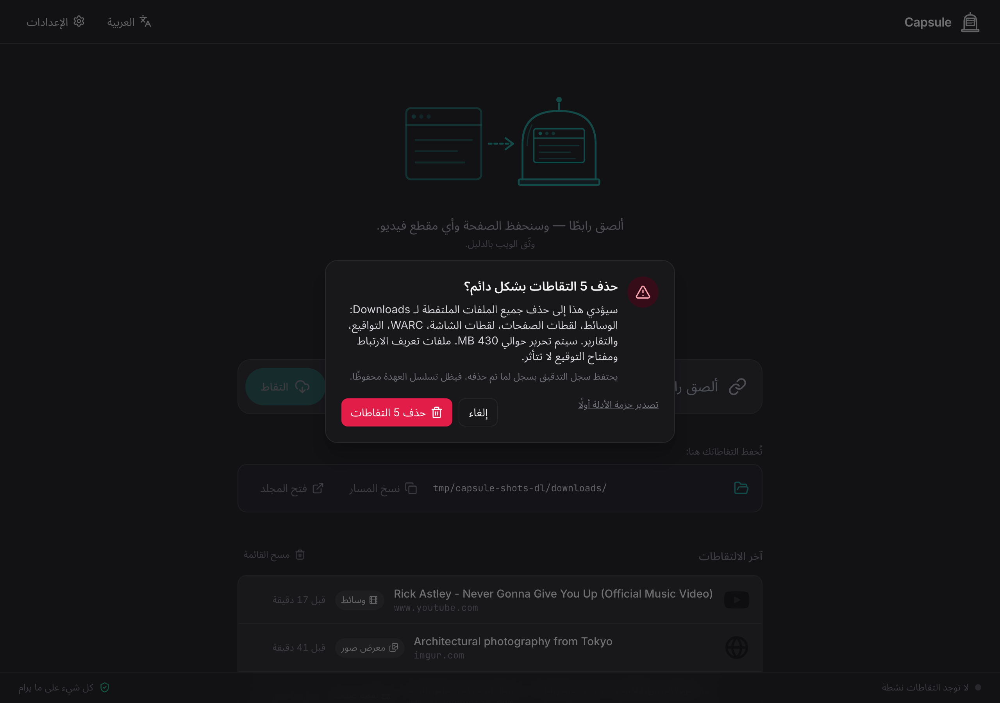

# دليل مستخدم Capsule

*وثّق الويب بالدليل.*

يمرّ هذا الدليل على كلّ ميزة في Capsule — ماذا تفعل ولماذا تفعلها وكيف تستخدمها بكفاءة. إن كنت تحتاج فقط إلى البدء، راجع **دليل البدء السريع**.

---

## ١. لمَن وُضع Capsule

Capsule مُوجَّه إلى المحقّقين — الباحثين والصحفيّين والمحامين والعاملين في الإثبات القضائي — الذين يحتاجون إلى التقاط المواد الإلكترونية بطريقة تصمد أمام التدقيق لاحقًا. يُجيب التطبيق على أربعة أسئلة لكلّ عنصر تحفظه:

١. **من أين جاء؟** الرابط الأصلي، سلسلة التحويلات، ترويسات الاستجابة، المنصّة.
٢. **متى تمّ الالتقاط؟** ختم زمني بالتوقيت العالمي UTC، على سجلّ تدقيق مقاوم للتلاعب.
٣. **هل المادة سليمة؟** بصمات MD5 و SHA-256 لكلّ ملف، مع توقيع تشفيري.
٤. **مَن قام بالالتقاط؟** بصمة مفتاح التوقيع الخاصّ بك.

لا يحلّ Capsule محلّ التعامل الحذر بالأدلّة، لكنه يُزيل أكثر الأسباب شيوعًا للطعن في الالتقاطات: مصدر مجهول، توقيت غير واضح، غياب التحقّق من السلامة، غياب التوقيع.

---

## ٢. ما تُظهره الواجهة في الإصدار الأول

التطبيق كله، في الإصدار الأول، شاشةُ **تنزيل** واحدة، إضافةً إلى لوحة **الإعدادات**. ألصق رابطًا (أو قائمة)، تابع شريط التقدّم رباعي المراحل، ثمّ اعثر على النتيجة في قائمة «آخر الالتقاطات» تحت النموذج. هذا كلّ ما في الواجهة.



أمّا الآلية الجنائية — مجلّدات القضايا، ملفات تعريف الارتباط لكلّ قضية، سجلّ التدقيق المسلسل بالتجزئة، حِزَم تصدير الأدلّة الموقَّعة — فما زالت تعمل لكلّ التقاط. تَصِل إليها عبر نظام الملفات للمضيف (`~/Documents/Capsule/`) وعبر الـ API. الفصول ٣–٧ أدناه تشرح **ما يوجد على القرص** و**كيف تستخدم الـ API** عند الحاجة.

أُضيف في الإصدار v0.4 تدفّقان تفاعليّان يعيشان في الصفحة الرئيسية: **كشف التكرار** عند اللصق (نافذة «مُلتقَط من قبل» تعترض الروابط المُلتقَطة سابقًا في القضية الحالية) وزرّ **مسح القائمة** أعلى قائمة آخر الالتقاطات (مع تأكيد للإجراء التدميري يعرض تصدير حزمة أدلّة أولًا).

---

## ٣. القضايا

القضية تحقيق واحد، تملك التقاطاتها وملفات تعريف الارتباط الخاصّة بها وحصّتها من سجلّ التدقيق. على القرص، كلّ قضية في مجلّد خاص بها تحت `~/Documents/Capsule/{slug-القضية}/`.

### كيف تعمل القضايا في الإصدار الأول

القضايا من الدرجة الأولى في الواجهة الخلفية (نظام الملفات، قاعدة البيانات، سجلّ التدقيق) لكنّها **بلا واجهة في الإصدار الأول**. التثبيتات الجديدة تستخدم المعرّف `downloads` — كلّ التقاط يصل إلى `~/Documents/Capsule/downloads/`. (التثبيتات القديمة التي تسبق إعادة التسمية تحتفظ بالمعرّف القديم `quick-captures` إلى ما لا نهاية حتى تبقى سلاسل أدلّتها سليمة.)

إن احتجت إلى قضايا إضافية — مثلًا مجلّد منفصل لكلّ تحقيق — أنشئها عبر الـ API:

```
POST /api/cases       { "name": "توثيق ساحة بلازا" }
GET  /api/cases       → قائمة بكلّ القضايا مع المعرّف والحالة
```

يُولَّد المعرّف من الاسم، ويُنقّى ليكون آمنًا على كلّ نظام ملفات (تنطبق قواعد NTFS في Windows على ملفات Mac أيضًا، كي تتنقّل المكتبة بين الأجهزة دون مفاجآت). تظلّ أداة التنزيل تُرسل إلى القضية الافتراضية؛ بدّل القضية النشطة من الـ API بتمرير `case_id` إلى `POST /api/jobs/batch`.

---

## ٤. التقاط رابط

في الصفحة الرئيسية، ألصق رابطًا في حقل الإدخال واضغط **التقاط**. لعدّة روابط، انتقل إلى تبويب **روابط متعددة**، ألصق رابطًا واحدًا في كلّ سطر، ثمّ اضغط **التقاط الكل**.

ما يفعله Capsule بالترتيب:

١. **تصنيف الرابط.** يحلّ التحويلات، يحدّد المنصّة (يوتيوب، تويتر/X، تيك توك، Pixiv، Imgur…)، ويتحقّق ممّا إذا كانت القضية تملك ملفات تعريف ارتباط للنطاق.
٢. **التقاط الصفحة.** لقطة كاملة للصفحة، نسخة MHTML مستقلّة، وأرشيف WARC للصفحة وكلّ مواردها الفرعية.
٣. **تنزيل الوسائط** إن وُجدت — فيديو، صوت، أو كلّ صور المعرض — باستخدام yt-dlp (لمقاطع الفيديو) و gallery-dl (للمواقع التي تتمحور حول الصور) في الخلفية.
٤. **التجزئة والتوقيع.** يحصل كلّ ملف على بصمتي MD5 و SHA-256، تُكتب ملفّات PDF (البيان والتقرير) حسّاسة للّغة، ثمّ يُوقَّع سجلّ البيانات الوصفية بمفتاح Ed25519 الخاصّ بك.

ترى أربع أيقونات تُضيء مع اكتمال كلّ مرحلة: كرة أرضية (الصفحة)، سحابة تنزيل (الوسائط)، علامة التجزئة (التحقّق)، درع به علامة (التوقيع).

### كشف التكرار (v0.4)

قبل بدء أي عمل من ذلك، يتحقّق Capsule من مكتبتك بحثًا عن رابط مطابق عبر `POST /api/jobs/preflight`. إن وجد واحدًا، تُفتح نافذة **مُلتقَط من قبل** خلال ثوانٍ — بلا لقطة أو تنزيل ضائعَين.



تعرض النافذة ثلاثة أزرار:

- **فتح الموجود** — يكشف عن مجلّد العنصر المحفوظ. يُسجَّل `duplicate.opened_existing` في سجلّ التدقيق.
- **إعادة الالتقاط كعنصر جديد** — يشغّل خطّ الالتقاط رغم ذلك. يحصل العنصر الجديد على لاحقة `__c2` / `__c3` كي تعيش النسختان جنبًا إلى جنب، ويُسجَّل `meta.json.force_recapture_index`. يُسجَّل `duplicate.recaptured` مع `original_id` و `new_id`.
- **إلغاء** — يُسقط الرابط. يُسجَّل `duplicate.cancelled`.

عند لصق دفعة فيها عدّة تكرارات، تضع النافذة العناصر في طابور وتُظهر مؤشّر **«١ من N»** أعلى النافذة كي تعرف كم قرارًا متبقّيًا. يستخدم الفحص شكلًا قانونيًا للرابط (المضيف بأحرف صغيرة، مفاتيح الاستعلام مرتّبة، معاملات التتبّع محذوفة) كي ينهار `?utm_source=email` و `?utm_source=tweet` إلى مفتاح إزالة تكرار واحد. الأصول (`url_submitted`، `url_final`) تبقى محفوظة حرفيًا في `meta.json`.

### أنواع الالتقاط

كلّ رابط يُنتج حزمة لقطة. ما يُحفظ معها يحدّد النوع:

- **وسائط + صفحة** — استخرج yt-dlp مقطع فيديو أو صوتًا أو صورة واحدة.
- **معرض صور + صفحة** — لم يجد yt-dlp شيئًا، لكنّ gallery-dl استخرج مجموعة صور متعدّدة (Pixiv، DeviantArt، Imgur، سلاسل صور تويتر، عرض Instagram، معارض Reddit، Tumblr، ArtStation، Patreon، Fanbox، Flickr).
- **صفحة فقط** — لم يجد أيّ من المستخرجَين وسائط. تُحفظ لقطة الصفحة وتُجزّأ وتُوقَّع رغم ذلك.

فشل تنزيل الوسائط أو المعرض **لا يعني** فشل الالتقاط. حزمة لقطة الصفحة محفوظة.

### خيارات التنزيل (v0.7)

بين نموذج الرابط ولوحة المهامّ النشطة قسمٌ قابل للطيّ اسمه **خيارات التنزيل** يكشف ثلاثة مفاتيح تُعدّل ما يفعله yt-dlp. مغلق افتراضيًا — تبقى الالتقاطات «الصق وانطلق» إلى أن تفتحه. تُحفظ تفضيلاتك في `localStorage` وتُطبَّق على كلّ رابط تُرسله من النموذج إلى أن تُغيّرها.

- **الصوت فقط** — استخراج تدفّق الصوت وحده وتجاهل الفيديو. لقطة الصفحة (MHTML / PNG / WARC) تظلّ تحفظ مشغّل الفيديو الكامل من لحظة الالتقاط، والسجلّ الجنائي لا يتأثّر. يُسجَّل الخيار في `meta.json.download_options.audio_only` ويظهر بوصفه قسمًا اسمه **خيارات التنزيل** في تقرير PDF لكلّ عنصر، فلا يحار المتلقّي لماذا الوسائط على القرص ملفّ `.mp3` بينما اللقطة تُظهر فيديو.
- **الجودة** — الأفضل / حتى 1080p / حتى 720p / حتى 480p / صوت. يقابل ذلك في yt-dlp الصيغة `--format bestvideo[height<=N]+bestaudio/best[height<=N]`؛ خيار **الأفضل** يُلغي أيّ سقف موضوع على مستوى القضية. يُسجَّل في `meta.json.download_options.quality_cap`.
- **الترجمات** — قائمة شرائح متعدّدة الاختيار للّغات (الإنجليزية، اليابانية، العربية، الإسبانية، الفرنسية، الألمانية، الصينية، البرتغالية، إضافةً إلى **جميع اللغات**). تُحفظ بصيغة `.vtt` ملفّاتٍ جانبيةً بجوار ملف الوسائط عبر `--write-subs --sub-langs <csv>` في yt-dlp.

هذه **خيارات تنزيل**، لا تعديلات بعد الالتقاط: البايتات التي يكتبها yt-dlp هي البايتات نفسها التي قدّمها المصدر. لقطة الصفحة لا تتأثّر بأيٍّ من هذه المفاتيح.

### الإيقاف المؤقت والاستئناف وإعادة التشغيل والإلغاء (v0.7)

كلّ بطاقة لمهمّة نشطة تحوي شريط أدوات أيقوني مع `aria-label` مترجمة:

- **إيقاف مؤقت** يوقف التنزيل في منتصفه؛ تُحفظ البايتات الجزئية كي يستطيع زرّ **استئناف** الإكمال من حيث توقّف (الافتراضي في yt-dlp هو `--continue`).
- **إعادة التشغيل** تحذف ملفّات `*.part` / `*.ytdl` وتبدأ الالتقاط من بايتات نظيفة. تختلف عن **استئناف** — استعملها حين يبدو التنزيل الجزئي تالفًا، أو حين تريد بايتات نظيفة جنائيًا. يُسجَّل `job.restarted` ويرتفع `meta.json.download_options.restart_count`. أيّ إعادة محاولة تلقائية لاحقة بعد عطل عابر تعود إلى `--continue`.
- **إلغاء** يُنهي المهمّة ويُسقط الملفّات الجزئية. لقطة الصفحة، إن كانت قد حُفظت، تبقى دون مساس.

كلٌّ من **إلغاء** و**إعادة التشغيل** يمرّ بنافذة تأكيد للإجراء التدميري (بالشكل نفسه لنافذة مسح القائمة في v0.4)، أمّا **إيقاف مؤقت** و**استئناف** فيُنفَّذان مباشرةً لأنّهما قابلان للتراجع.

### الالتقاطات المتوقّفة (v0.7)

ثمّة مراقب يستيقظ كلّ خمس ثوانٍ تقريبًا. إن مرّت 90 ثانية على مهمّة دون أيّ تقدّم من yt-dlp، تظهر شارة عنبرية **متوقّف — لا تقدّم لـ N ثانية** على بطاقة المهمّة. تختفي الشارة بمجرّد عودة التقدّم — **لا قتل تلقائي** على الإطلاق. التوقّف إشارة في الواجهة، وليس شرط إنهاء.

يُسجَّل `download.stalled` عند ظهور الشارة و`download.stall_cleared` حين يعود التقدّم. عدد التوقّفات لكلّ مهمّة يُكتب في `meta.json.capture.stalled_count` و`meta.json.download_options.stalled_count`، فيرى المتلقّي بدقّة كم توقّفًا اجتازه هذا الالتقاط.

إن استمرّ التوقّف، استعمل شريط الأدوات — **إلغاء** بمعنى «اترك المهمّة»، أو **إعادة التشغيل** بمعنى «امحُ وأعد المحاولة».

---

## ٥. حزمة الالتقاط

لكلّ عنصر، يكتب Capsule مجلّدًا مستقلًا وكاملًا للعنصر:

```
~/Documents/Capsule/downloads/
└── youtube__veritasium__The_Most_Stubbornly_…__abc123XYZ/
    ├── youtube__veritasium__…__abc123XYZ.report.pdf       ← قابل للقراءة
    ├── youtube__veritasium__…__abc123XYZ.manifest.pdf     ← البصمات الكاملة
    ├── Captures/
    │   ├── youtube__veritasium__…__abc123XYZ.page.mhtml
    │   ├── youtube__veritasium__…__abc123XYZ.page.png
    │   └── youtube__veritasium__…__abc123XYZ.page.warc.gz
    ├── Media/
    │   ├── youtube__veritasium__…__abc123XYZ.mp4          ← ملف الوسائط
    │   └── youtube__veritasium__…__abc123XYZ.thumbnail.jpg
    └── Metadata/
        ├── youtube__veritasium__…__abc123XYZ.meta.json
        ├── youtube__veritasium__…__abc123XYZ.meta.json.sig
        ├── youtube__veritasium__…__abc123XYZ.checksums.txt
        ├── youtube__veritasium__…__abc123XYZ.info.json    ← بيانات yt-dlp الوصفية
        └── youtube__veritasium__…__abc123XYZ.description.txt
```

نمط اسم الملف القانوني للوسائط هو `{المنصّة}__{صاحب التحميل}__{العنوان}__{التاريخ}__{معرّف الفيديو}.{الامتداد}`، بعد تنقيته ليكون نقّالًا بين الأنظمة.

ملف `checksums.txt` يستخدم تنسيق `md5sum -c` / `sha256sum -c` المعياري — افتح طرفية، شغّل أمر التحقّق، واحصل على PASS/FAIL سطرًا بسطر.

### تخطيط معرض الصور

تَشترك التقاطات معارض الصور في تخطيط مجلّد العنصر نفسه ولكن تستبدل ملف الوسائط الواحد بمجموعة صور مرقّمة، إضافةً إلى ملف بيانات وصفية على مستوى المعرض:

```
└── pixiv__user__series_title__dl-2026-05-07__a1b2c3d4e5f6/
    ├── …report.pdf             ← قابل للقراءة + شريط مصغّرات (حتى ٢٠ صورة مصغّرة)
    ├── …manifest.pdf           ← كلّ صورة مدرجة بالبصمات الكاملة
    ├── Captures/               ← page.mhtml ، page.png ، page.warc.gz
    ├── Media/
    │   ├── …001.jpg            ← الصورة #١
    │   ├── …002.png
    │   └── …                   ← (حتى gallery_max_items)
    └── Metadata/
        ├── …001.json           ← البيانات الوصفية لكلّ صورة من gallery-dl
        ├── …002.json
        ├── …gallery_info.json  ← البيانات الوصفية على مستوى المعرض
        ├── …meta.json          ← السجلّ القانوني (يشمل gallery_count و gallery_extractor)
        ├── …meta.json.sig
        └── …checksums.txt
```

كلّ صورة لها بصمتا MD5 و SHA-256 الخاصّتان بها، والمجموعة كلّها مربوطة بتوقيع `meta.json.sig` القانوني — توقيع واحد يُغطّي كلّ صورة.

العنوان والرابط الأصليان دون اقتطاع موجودان في `meta.json` — لا يُفقَدان أبدًا.

### ملفّا PDF لكلّ عنصر

كلّ التقاط يكتب ملفَّي PDF حسّاسَين للّغة في أعلى مجلّد العنصر، فيراهما المتلقّي أوّلًا:

- **`{stem}.manifest.pdf`** — A4 أفقي، جدول ملفّات جاهز للتحقّق ببصمات MD5 (٣٢ خانة سداسية) و SHA-256 (٦٤ خانة سداسية) **كاملة** دون اقتطاع لكلّ ملف في مجلّد العنصر. الترويسة تحمل الرابط المصدر، الختم الزمني للالتقاط بالتوقيت العالمي UTC، وبصمة مفتاح التوقيع.
- **`{stem}.report.pdf`** — رفيق قابل للقراءة: المصدر (الروابط، سلسلة التحويلات، وقت الالتقاط UTC، الناشر، تاريخ الرفع، المدّة، النطاقات المُصادَق عليها)، الوصف الكامل دون اقتطاع (موزَّع على صفحات)، جدول الأدوات والإصدارات، وتقرير من جانب الالتقاط (نتائج انتظار العرض، عدد الطلبات المحجوبة، أعلام إخفاء الشريط، الجاهزية، لغة التقرير، تجميد الحركات قبل اللقطة، عدد رسائل وحدة التحكم بالمتصفح وأخطائها، حالة لقطة سياق الوسائط، مصدر جلسة WARC — جلسة واحدة CDP→WARC مقابل بديل بعملية فرعية browsertrix-crawler — وملاحظة الاقتطاع للصفحات الطويلة جدًا). عند تفعيل أيّ خيار تنزيل غير افتراضي — الصوت فقط، أو سقف الجودة، أو الترجمات، أو عدد إعادات التشغيل، أو عدد التوقّفات — يُضاف قسم **خيارات التنزيل** كي يرى المتلقّي بدقّة أيّ خيارات شكّلت هذا الالتقاط. للمعارض، يُضاف شريط مصغّرات بحدّ أقصى ٢٠ صورة.

يُعرَض الملفّان بأي لغة كانت نشطة في الواجهة عند تقديم الالتقاط (`en`، `ar`، `ja`، `es`). كلا الملفّين مرجوعَين بالبصمة في `meta.json` ومن ثَمّ موقَّعَين بالتبعية بفضل `meta.json.sig` — لا حاجة لمسار توقيع إضافي.

---

## ٦. ملفات تعريف الارتباط والالتقاط الموثّق

بعض المحتوى لا يظهر إلّا بعد تسجيل الدخول: حسابات خاصّة، مقاطع فيديو محصورة عُمريًا، مقالات خلف اشتراك، منتديات للأعضاء فقط، معارض صور على Pixiv / DeviantArt / Patreon / Fanbox. يدعم Capsule هذا بطريقتين:

### الطريقة الموصى بها: إضافة متصفّح Capsule

اقرن إضافة Capsule (الإعدادات ← إضافة المتصفح)، ثمّ اضغط **إرسال علامة التبويب هذه** أو **مزامنة ملفات تعريف الارتباط** في النافذة المنبثقة للإضافة. تستطيع الإضافة قراءة ملفات تعريف الارتباط من نوع **HttpOnly** وملفات تعريف الارتباط المُجزَّأة من طرف ثالث التي لا تستطيع الصفحة نفسها كشفها، وتمرّ على كلّ مخازن ملفات تعريف الارتباط (الافتراضي + الحاويات + المُجزَّأة) كي تعمل تدفّقات الحسابات المتعدّدة.

### الطريقة البديلة: رفع ملف cookies.txt

صدّر ملفات تعريف الارتباط من المتصفّح بإضافة بصيغة Netscape، ثمّ ارفعه عبر:

```
POST /api/cookies                multipart with file=cookies.txt&case_slug=downloads
```

تصل كلتا الطريقتين إلى ملف Netscape نفسه تحت `/config/cases/{slug-القضية}/cookies.txt`. تُعرض فقط قائمة النطاقات وتواريخ الانتهاء؛ **قيم ملفات تعريف الارتباط نفسها لا تُعرَض أبدًا، ولا تُسجَّل، ولا تُدرَج في تصدير الأدلّة.**

### ملفات تعريف ارتباط مؤقّتة (لاستخدام واحد)

تعرض النافذة المنبثقة للإضافة مفتاحًا لكلّ تقديم اسمه **ملفات تعريف ارتباط مؤقّتة**. عند تفعيله، تذهب ملفات تعريف الارتباط إلى الواجهة الخلفية في مجلّد مؤقّت لكلّ مهمّة، تستعملها Playwright (للصفحة وأرشيف WARC في الجلسة نفسها) و yt-dlp و gallery-dl لتلك المهمّة الواحدة، ثمّ تُحذف بعد انتهائها — لا تُكتب أبدًا إلى مجلّد القضية. يُسجِّل سجلّ التدقيق `cookies.ephemeral_used` ببصمة اللقطة، دون القيم.

### الإلصاق التلقائي للمواقع المعروفة

عند تقديم رابط نطاقه يطابق ملفات تعريف الارتباط المخزَّنة، يعرض Capsule شارة **مُسجَّل الدخول إلى {النطاق}** على معاينة الالتقاط، ويمرّر ملفات تعريف الارتباط إلى كلّ أداة في خطّ الإنتاج — Playwright (لقطة الصفحة)، yt-dlp (الفيديو/الصوت)، و gallery-dl (معارض الصور) — كي تأتي اللقطة والوسائط والمعرض من الجلسة الموثّقة نفسها.

تُغطّي قائمة الإلصاق التلقائي المنصّات الاجتماعية والمواقع التي تتمحور حول الصور: Twitter/X، Facebook، Instagram، TikTok، LinkedIn، Reddit، YouTube (الخاص/المحدود عُمريًا)، Threads، Pixiv، DeviantArt، Tumblr، Flickr، Imgur، Patreon، ArtStation، Fanbox.

عند بدء المهمّة، تُجزّئ الواجهة الخلفية ملف ملفات تعريف الارتباط (`cookies_snapshot_sha256`، يُسجَّل في `meta.json` وسجلّ التدقيق) وتُبلغ عن أيّ نطاقات منتهية أو على وشك الانتهاء. ملفات تعريف الارتباط المتقادمة تُلصَق رغم ذلك، لكن سجلّ التدقيق يحصل على إدخال `cookies.stale_at_capture`.

---

## ٧. قائمة آخر الالتقاطات

قائمة آخر الالتقاطات في الصفحة الرئيسية هي واجهة الإصدار الأول لتصفّح ما حفظته.



كلّ صف يُظهر أيقونة المنصّة، العنوان (سطر واحد، مع علامة قطع، آمن للاتجاهين عبر `<bdi>`)، مضيف الرابط المصدر في سطر ثانوي، شريحة نوع الالتقاط (وسائط / معرض صور / لقطة صفحة)، شارة سلامة، ووقت نسبي. حرّك المؤشّر فوق الصف ليكشف عن إجراء **فتح المجلّد**.

### مسح القائمة

زرّ **مسح القائمة** أعلى القائمة يحذف كلّ مجلّدات العناصر للقضية النشطة، يُسقط صفوف `downloads`، ويُتالي حذف `capture_groups` اليتيمة. يُحفَظ صفّ القضية نفسه، ومجلّد القضية، وملف `cookies.txt` الخاصّ بالقضية، ومفتاح التوقيع، **وكلّ** صفوف `audit_log` السابقة. يحصل سجلّ التدقيق على صفّ مُجمَّع واحد `library.cleared` بلقطة لكلّ عنصر محذوف (المعرّف، url_hash، تاريخ الالتقاط، بصمة الوسائط SHA-256، بصمة meta.json SHA-256) — مرساة تسلسل العهدة لحدث الحذف.

تأكيد للإجراء التدميري يحرس النداء:



تُخبرك النافذة بدقّة بما سيُحذف، تُقدّر البايتات المحرَّرة، تُذكّرك بأنّ سجلّ التدقيق يحتفظ بالسجلّ، وتعرض زرّ **تصدير حزمة الأدلّة أولًا** كي تستطيع تسليم الحزمة قبل مسح الأصول.

### قراءة المكتبة الأوسع

لأي شيء يتجاوز قائمة آخر الالتقاطات — تصفية بالجملة، جرد كامل للمكتبة، تكامل مع أدوات أخرى — استخدم الـ API أو المجلّدات على القرص:

```
GET /api/library                        قائمة بكلّ التقاط (مع ترقيم صفحات)
GET /api/library/export?format=csv      ملف CSV حسب RFC 4180 لكلّ صف
GET /api/library/export?format=json     JSON يشمل meta_json
```

ملف CSV هو الأسهل للجداول الإلكترونية وأدوات إدارة القضايا؛ تفريغ JSON هو ما يجب أن تستهلكه خطوط الإنتاج الجنائية الأخرى.

---

## ٨. التحقّق من السلامة

كلّ ناتج يُجزَّأ، وسجلّ البيانات الوصفية يُوقَّع. يمكنك إعادة الفحص في أيّ وقت:

- **عنصر واحد:** شغّل `verify.py` على مجلّد العنصر (السكربت مرفق داخل كلّ تصدير أدلّة، لكنّك تستطيع تشغيله مستقلًا — راجع §١٤ أدناه).
- **المكتبة كاملةً:** نادِ `POST /api/library/verify`. يعيد PASS/FAIL لكلّ عنصر مع الفرق (أيّ ملف اختلفت بصمته، البصمة المتوقَّعة، البصمة المرصودة، سبب فشل التوقيع).
- **حزمة استلمتها:** كلّ تصدير أدلّة يأتي مع سكربت مستقلّ `verify.py` تشغّله بلا تبعيّات سوى مكتبة `cryptography`.

عند فشل التحقّق تحصل على الفرق الفعلي، لا «خطأ سلامة» عام — كي تعرف بالضبط أيّ ملف أو توقيع تعطّل.

---

## ٩. سجلّ التدقيق

كلّ عملية تُغيّر الحالة — إنشاء قضية، بدء التقاط، التقاط صفحة، تنزيل وسائط، إنشاء توقيع، التحقّق من عنصر، تصدير قضية — تُسجَّل في سجلّ تتابعي يُربط بسلسلة تجزئة ولا يقبل التعديل. كلّ مدخل يحوي بصمة المدخل السابق. إن عُدِّل صف، تنكسر السلسلة عنده وتستطيع تحديد المكان بدقّة.

سجلّ التدقيق **غير ظاهر في واجهة الإصدار الأول**. هو يُكتب دائمًا، ويمكن الوصول إليه عبر `GET /api/audit` وفي ملف `audit_log.json` داخل كلّ حزمة لتصدير الأدلّة.

أضافت الإصدارات من v0.4 إلى v0.7 جملةً من إجراءات التدقيق الجديدة الجديرة بالملاحظة:

- **كشف التكرار (v0.4):** `duplicate.detected` (تطابق preflight قبل اختيار المستخدم)، `duplicate.opened_existing`، `duplicate.recaptured` (مع `original_id` و `new_id`)، `duplicate.cancelled`.
- **مسح القائمة (v0.4):** `library.cleared` — صفّ لقطة مُجمَّع واحد يحفظ المعرّف و url_hash وتاريخ الالتقاط وبصمة الوسائط SHA-256 وبصمة meta.json SHA-256 لكلّ عنصر محذوف. صفّ القضية ومجلّد القضية وملفات تعريف الارتباط ومفتاح التوقيع وصفوف التدقيق السابقة لا تُمَسّ.
- **معارض الصور (v0.5):** `gallery.started` (لكلّ استدعاء gallery-dl) متبوعةً بنتيجة واحدة فقط — `gallery.captured` (مع `image_count` و `extractor`)، `gallery.empty`، `gallery.rate_limited`، `gallery.auth_required`، أو `gallery.failed`.
- **تحصين حفظ الصفحة (v0.6):** `capture.warc_session_in_process` / `capture.warc_session_subprocess` (أيّ كاتب WARC نفّذ المهمّة)، `capture.animations_frozen` (تجميد الحركات بـ CSS قبل اللقطة)، `capture.media_context_captured` (لقطة بحجم الشاشة مؤطَّرة على عنصر الفيديو الرئيسي في الصفحة)، `capture.console_messages_recorded` (حفظ رسائل وحدة التحكم بالمتصفح وأخطاء الصفحة في ملفّ جانبي)، `capture.screenshot_truncated` (صفحة طويلة جدًا، اقتُطعت اللقطة عند 30,000 بكسل بينما يبقى MHTML و WARC كاملَين)، `capture.readiness_budget_exceeded` (تجاوزت ميزانية انتظار العرض الخارجية 60 ثانية، فتُخطَّى المراحل المتبقّية).
- **عناصر التحكّم بالتنزيل (v0.7):** `download.options_applied` (يُسجَّل عند الإرسال متى كان أيّ مفتاح غير افتراضي)، `download.stalled` / `download.stall_cleared` (لا تقدّم لـ 90 ثانية، ثمّ عاد التقدّم)، `job.restarted` (إعادة تشغيل ببايتات نظيفة، تختلف عن إعادة المحاولة التلقائية)، إضافةً إلى `job.paused` / `job.resumed` / `job.cancelled` القائمة من شريط أدوات المهمّة.

---

## ١٠. تصدير الأدلّة

عندما تكون جاهزًا للتسليم، شغّل التصدير من الـ API:

```
POST /api/cases/{id}/export?lang=ar      → ملف zip موقَّع + تقرير PDF حسّاس للّغة
```

الحزمة ملف zip واحد يحتوي على:

- ملف `manifest.json` يُدرج كلّ ملف بدوره وحجمه وبصمتي MD5 و SHA-256.
- `manifest.sig` — توقيع Ed25519 المنفصل لبيان المحتويات.
- `public_key.pem` — كي يستطيع المتلقّي التحقّق.
- **تقرير PDF للقضية** حسّاس للّغة (يدعم العربية بترتيب من اليمين إلى اليسار).
- `audit_log.json` — مدخلات سجلّ التدقيق الكاملة لهذه القضية.
- `verify.py` — السكربت المستقلّ للتحقّق (التبعية الوحيدة `cryptography`).
- شجرة `downloads/` تُرايي تخطيط مجلّد العنصر على القرص بدقّة: كلّ مجلّد `{stem}/` يحوي ملفَّي الـPDF (`{stem}.report.pdf` + `{stem}.manifest.pdf`) في الجذر، إضافةً إلى المجلّدات الفرعية `Captures/` و `Media/` و `Metadata/` التي تضمّ ثلاثيّ لقطة الصفحة (`mhtml`/`png`/`warc.gz`)، وملف الوسائط (إن وُجد)، و `meta.json` + `.sig` + `checksums.txt`.

يُشغّل المتلقّي `python verify.py path/to/bundle/` فيحصل على تقرير PASS/FAIL. لا يحتاج إلى تثبيت Capsule.

---

## ١١. التحديثات

لا يُحدّث Capsule نفسه تلقائيًا، ولا يستفسر صامتًا عن التحديثات. أنت تقرّر متى.

في **الإعدادات ← التحديثات**، انقر **التحقّق من وجود تحديثات**. يُجري Capsule استعلامًا واحدًا لواجهة GitHub ويُخبرك بما هو متاح لكلٍّ من yt-dlp و gallery-dl (مكوّنا التشغيل القابلان للتحديث). إن وافقت، يُثبَّت الإصدار الجديد داخل الحاوية، ويُسجَّل في سجلّ التدقيق `system.updated` مع علامة المكوّن.

خلف الكواليس:

```
GET  /api/system/version                              → app, yt_dlp, gallery_dl, chromium, browsertrix
POST /api/system/update?component=yt-dlp              ترقية yt-dlp
POST /api/system/update?component=gallery-dl          ترقية gallery-dl
```

إن فشل التقاط بنوع الخطأ الذي يدلّ عادةً على قِدَم أحد المُنزِّلَين (خطأ yt-dlp «المستخرج قديم»، أو رسائل gallery-dl «حدّ من المعدّل» / «مطلوب تسجيل دخول»)، تعرض بطاقة الفشل زرّ **التحقّق من وجود تحديثات** السياقي.

---

## ١٢. الإعدادات


لوحة الإعدادات هي ثاني سطحَي الواجهة في الإصدار الأول. أربع بطاقات:

- **اللغة** — العربية، الإنجليزية، اليابانية، الإسبانية. التبديل في أي وقت دون إعادة تحميل. اللغة النشطة تقود أيضًا كلّ ملف PDF لعنصر يُعرَض ما دامت مضبوطة.
- **مفتاح التوقيع** — اعرض بصمتك. (تحتفظ العناصر السابقة بتوقيعها الأصلي بصرف النظر عن أيّ تغيير لاحق للمفتاح؛ استيراد المفتاح مدعوم عبر الـ API لكنّه ليس زرًّا في الواجهة في الإصدار الأول.)
- **إضافة المتصفح** — المسار الموصى به لملفات تعريف الارتباط. **اقتران إضافة جديدة** يُولِّد رمزًا يُعرَض مرّة واحدة فقط. أسفله، أكورديون تثبيت داخل التطبيق يُرشدك خطوةً بخطوة لتحميل الإضافة في Chrome / Edge / Brave / Firefox. قائمة الإضافات المُقترنة تعرض الاسم وآخر استخدام وزرّ **إبطال**. تدوير الرموز متاح عبر `POST /api/extension/pair/{token_id}/rotate` (يُصدر رمزًا جديدًا ويُبطل القديم في نداءٍ واحد).
- **التحديثات** — تحقّق يدوي، راجع §١١.

---

## ١٣. حلّ المشكلات

- **يقول المُشغِّل إنّ Docker لا يعمل.** افتح Docker Desktop من Applications (macOS) أو قائمة Start (Windows) وانتظر اكتمال تشغيله.
- **يقول المُشغِّل إنّ المنفذ 8080 مُستخدم.** أوقف ما يستخدم المنفذ 8080، أو عدّل المُشغِّل لاستخدام منفذ آخر (`-p 9090:8080`).
- **فشل التقاط ما.** انقر **إظهار التفاصيل التقنية** على بطاقة الخطأ. تتضمّن الرابط، الختم الزمني، إصدارات كلّ الأدوات، ومخرجات الخطأ كاملةً — ألصقها في تقرير الخطأ.
- **يحجبني الموقع.** جرّب رفع ملفات تعريف ارتباط للموقع (راجع §٦) ثمّ أعِد الالتقاط.
- **يحدّ الموقع من معدّل طلباتي.** انتظر بضع دقائق ثمّ انقر **إعادة المحاولة**.
- **«لا توجد صور في هذه الصفحة.»** لم تكن الصفحة تحوي أيّ صور يستطيع gallery-dl استخراجها؛ لقطة الصفحة تُحفظ مع ذلك بوصفها التقاط `page_only`.
- **التقاط معلَّق.** ظهور شارة **متوقّف** عنبرية يعني أنّ المهمّة لم تتقدّم منذ 90 ثانية لكنّها لم تمت — Capsule لا يُنهي المهامّ تلقائيًا أبدًا. استعمل شريط أدوات المهمّة: **إيقاف مؤقت** ثمّ **استئناف** للدفع، أو **إعادة التشغيل** ببايتات نظيفة جنائيًا، أو **إلغاء** للتخلّي.
- **التنزيل ضخم أو بطيء.** افتح **خيارات التنزيل** فوق لوحة المهامّ النشطة وضَع سقف الجودة عند **حتى 720p**، أو اختَر **الصوت فقط** للمدوّنات الصوتية والمحاضرات. لقطة الصفحة تُلتقَط بأقصى دقّة بصرف النظر عن ذلك.

---

## ١٤. لمتلقّي حزم الأدلّة

إن أرسل إليك أحدهم حزمة Capsule، يمكنك التحقّق من كلّ شيء دون تثبيت Capsule:

١. فُكّ ضغط الحزمة.
٢. افتح طرفية في مجلّد الحزمة.
٣. نفّذ `python verify.py .`
٤. اقرأ التقرير. PASS تعني أنّ كلّ ملف يطابق بيان المحتويات، وكلّ توقيع صالح، وسلسلة سجلّ التدقيق سليمة. FAIL تُحدّد بدقّة ما لا يتطابق.

تقرير PDF للقضية المُوقَّع داخل الحزمة قابل للقراءة وحسّاس للّغة — قارئ العربية يحصل على تقرير من اليمين إلى اليسار، وقارئ الإنجليزية يحصل على المحتوى نفسه من اليسار إلى اليمين.
