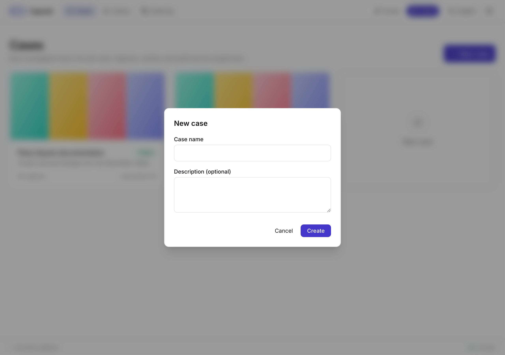
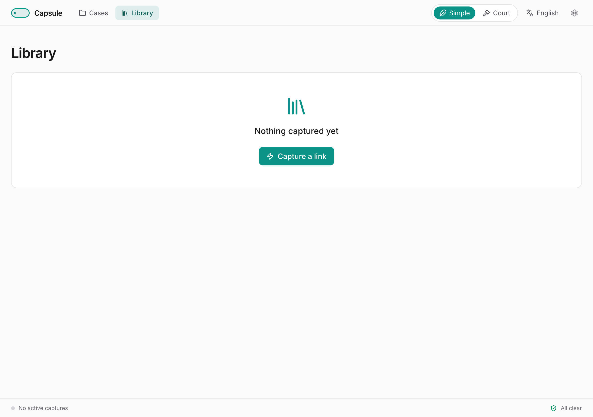
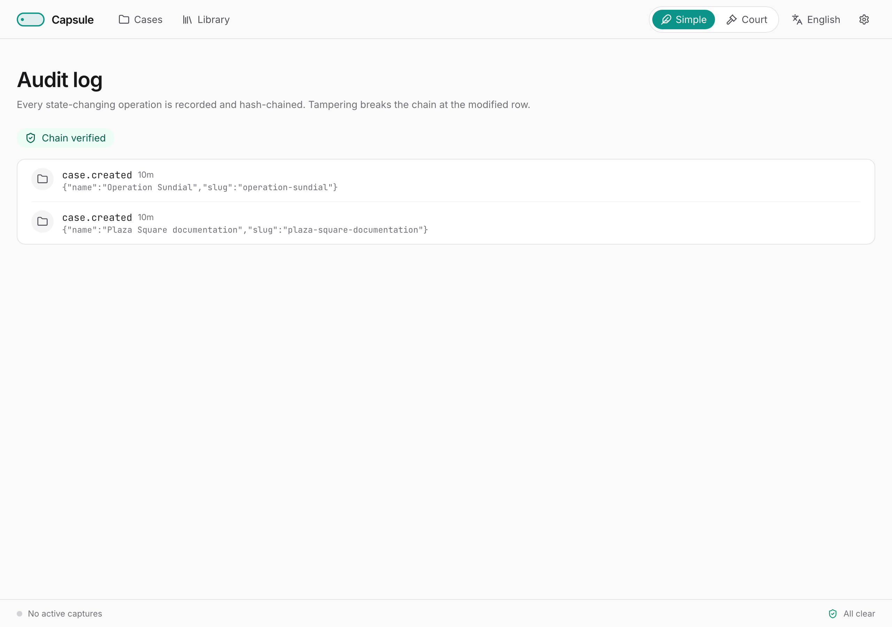

# Capsule User Guide

*Capture the web, with proof.*

This guide walks through every feature of Capsule — what it does, why it does it, and how to use it well. If you only need to get started, see the **Quick Start** instead.

---

## 1. What Capsule is for

Capsule is for investigators — researchers, journalists, lawyers, and discovery practitioners — who need to capture online material in a way that holds up to later scrutiny. The tool answers four questions for every item you save:

1. **Where did this come from?** The original URL, the redirect chain, the response headers, the platform.
2. **When was it captured?** UTC timestamp, on a tamper-evident audit trail.
3. **Is it intact?** MD5 and SHA-256 hashes of every file, plus a cryptographic signature.
4. **Who captured it?** The fingerprint of your signing key.

Capsule does not replace careful evidence handling — but it removes the most common reasons captures get challenged: unknown provenance, unclear timing, no integrity check, no signature.

---

## 2. What the v1 interface shows

The whole app, in v1, is a single **downloader** screen plus a **Settings** panel. Paste a URL (or a list), watch the four-phase progress strip, and find the result in the Recent captures grid below the form. That's it for the UI.

The forensic machinery — case-grouped folders, cookies-per-case, the hash-chained audit log, signed evidence-export bundles — still runs for every capture. It is reachable through the host filesystem (`~/Documents/Capsule/`) and over the API. Sections 3-7 below describe **what's on disk** and **how to use the API** when you need any of those things.

---

## 3. Cases

A case is one investigation. It owns its captures, its cookies, and its slice of the audit log. On disk, each case is its own folder under `~/Documents/Capsule/{case-slug}/`.

### Creating a case

Click **+ New case** on the Cases dashboard. Give it a name — the slug used on disk is generated from the name and is filesystem-safe on every platform.



### Working inside a case

A case has four tabs:

- **Captures** — every item saved in this case.
- **Cookies** — per-case cookies for authenticated sites (see §6).
- **Audit** — the per-case audit log entries.
- **Settings** — case-specific preferences (raw fragment retention, thumbnail prefetch).

### Archiving and reopening

The three-dot menu offers **Archive case** and **Export evidence**. Archived cases stay browsable and verifiable; only the visual emphasis changes. You can reopen any time.

---

## 4. Capturing a link

Open a case and click **Capture a link**. Paste any URL.

What Capsule does, in order:

1. **Classify the URL.** Resolves redirects, identifies the platform (YouTube, Twitter/X, TikTok, …), and checks whether the case has cookies for the domain.
2. **Snapshot the page.** A full-page screenshot, an MHTML self-contained snapshot, and a WARC archive of the page plus every sub-resource it loaded.
3. **Download the media** if any — video, audio, or image — using yt-dlp under the hood.
4. **Hash and sign.** Every file gets MD5 and SHA-256 hashes, then the metadata record is signed with your Ed25519 key.

You see four icons light up as each phase completes: globe (page), download cloud (media), hash mark (verify), shield with check (sign).

### Capture kinds

Every URL produces a snapshot package. Whether it produces a media file too determines the kind:

- **Media + page** — the URL had a video, audio, or image Capsule could download.
- **Page only** — no extractable media. The page snapshot is still saved, hashed, and signed.

A failed media download is **not** a failed capture. The page snapshot package is preserved.

---

## 5. The capture package

For every item, Capsule writes a sidecar folder beside the media file:

```
{case-slug}/
├── youtube__veritasium__The_Most_Stubbornly_…__abc123XYZ.mp4
└── sidecars/
    └── youtube__veritasium__The_Most_Stubbornly_…__abc123XYZ/
        ├── …meta.json            # the canonical metadata record
        ├── …meta.json.sig        # detached Ed25519 signature
        ├── …checksums.txt        # MD5 + SHA-256 of every artifact
        ├── …page.mhtml           # self-contained page snapshot
        ├── …page.png             # full-page screenshot
        ├── …page.warc.gz         # WARC archive
        ├── …info.json            # yt-dlp's full metadata dump
        ├── …description.txt      # video description (when present)
        └── …thumbnail.jpg        # video thumbnail (when present)
```

The canonical filename pattern is `{platform}__{uploader}__{title}__{date}__{video_id}.{ext}`, sanitized for cross-platform portability (Windows NTFS rules apply to Mac files too, so a library moves between machines without surprises).

The original, untruncated title and URL live in `meta.json` — never lost.

---

## 6. Cookies and authenticated capture

Some content is only visible when signed in: private accounts, age-gated videos, paywalled articles, member-only forums. Capsule supports this via per-case cookies.

### Uploading cookies

1. Open the case → **Cookies** tab.
2. Click **Upload cookies.txt**. Use a browser extension to export cookies from the site you want to capture, then upload the exported file.
3. Capsule shows the domains and expiry dates so you know which sites are covered. **Cookie values themselves are never displayed, never logged, and never included in evidence exports.**

### How they're used

When you paste a URL whose domain matches your uploaded cookies, you see an **Authenticated as {domain}** chip on the capture preview. The cookies are passed to both the page snapshot and the media downloader, so your snapshot and your media come from the same authenticated session.

Capsule auto-attaches cookies for all major social-media platforms it recognizes.

---

## 7. The library

The Library view shows captures across all cases as a thumbnail-dominant grid. Filter by case, platform, capture date, integrity status, or capture kind.



### Per-item actions

The three-dot menu on each card offers:

- **Open folder** in your file manager.
- **View details** — media tab, page snapshot tab, sidecars list, audit entries.
- **Verify integrity** — re-hashes every file and re-checks the signature. A green badge means everything matches; a red badge surfaces the diff.
- **Re-capture** — runs the URL again as a sibling entry.
- **Move to another case** — preserves the audit history.
- **Delete** — soft-deletes from the database; files stay on disk until you remove them yourself.

---

## 8. Integrity verification

Every artifact is hashed and the metadata record is signed. You can re-check this at any time:

- **Single item:** the **Verify integrity** action on the item card or detail page.
- **Whole library:** the bulk **Verify all** action in Library settings.
- **A bundle you received:** every evidence export ships with a standalone `verify.py` script.

A failed verification gives you the actual diff: which file's hash differs, the expected hash, the observed hash, and the signature failure (if any).

---

## 9. The audit log

Every state-changing operation — case created, capture started, page captured, media downloaded, signature created, item verified, case exported — is recorded in an append-only, hash-chained log.



Each entry includes its predecessor's hash. If a row is altered, the chain breaks at that row and the UI shows you exactly where.

The audit log is not surfaced in the v1 UI. It is always written and is reachable via `GET /api/audit` and as `audit_log.json` inside every evidence-export bundle.

---

## 10. Evidence export

When you're ready to hand off, click **Export evidence** on the case detail screen. The wizard offers:

1. **Pick contents** — by default, everything in the case. Optionally narrow by date or capture kind.
2. **Pick destination** — any folder on your computer.
3. **Review and confirm** — Capsule produces a signed zip and a PDF report.

The bundle contains:

- Every captured file with its sidecars,
- A `manifest.json` listing every file with role, size, MD5, SHA-256,
- `manifest.sig` — your detached Ed25519 signature of the manifest,
- `public_key.pem` — so the recipient can verify,
- A locale-aware **PDF case report** (Arabic-capable, RTL-correct),
- The full audit-log JSON for this case,
- `verify.py` — a standalone Python script the recipient can run with no dependencies beyond `cryptography`.

The recipient runs `python verify.py path/to/bundle/` and gets a PASS/FAIL report. They do not need to install Capsule.

---

## 11. Updates

Capsule never auto-updates and never polls for updates silently. You decide when.

In **Settings → Updates**, click **Check for updates**. Capsule makes a single GitHub API call and tells you what's available. If you say yes, the new yt-dlp version installs inside the container; the audit log records the change.

If a capture fails with the kind of error that usually means yt-dlp is out of date, the failure card offers a contextual **Check for yt-dlp update** button.

---

## 12. Settings


- **Language** — English, Arabic, Spanish, French. Switch any time; no reload.
- **Signing key** — view your fingerprint. Imported keys apply to future captures only; existing items keep their original signatures.
- **Browser extension** — pair the Capsule extension to send links and cookies straight from your browser.
- **Updates** — manual check, see §11.

---

## 13. Troubleshooting

- **The launcher says Docker isn't running.** Open Docker Desktop from Applications (macOS) or the Start menu (Windows) and wait for it to finish starting.
- **The launcher says port 8080 is already in use.** Stop whatever is using port 8080, or edit the launcher to use a different port (`-p 9090:8080`).
- **A capture failed.** Click **Show technical details** on the error card. It includes the URL, the timestamp, every tool's version, and the full error output — paste it into a bug report.
- **A site blocks me.** Try uploading cookies for that site (see §6) and re-capturing.
- **The site rate-limits me.** Wait a few minutes and click **Try again**.

---

## 14. For recipients of evidence bundles

If someone has sent you a Capsule export, you can verify everything without installing Capsule:

1. Unzip the bundle.
2. Open a terminal in the bundle folder.
3. Run `python verify.py .`
4. Read the report. PASS means every file matches the manifest, every signature is valid, and the audit-log chain is intact. FAIL identifies exactly what doesn't match.

The signed PDF report inside the bundle is human-readable and locale-aware — Arabic readers get a right-to-left report, English readers get the same content left-to-right.
