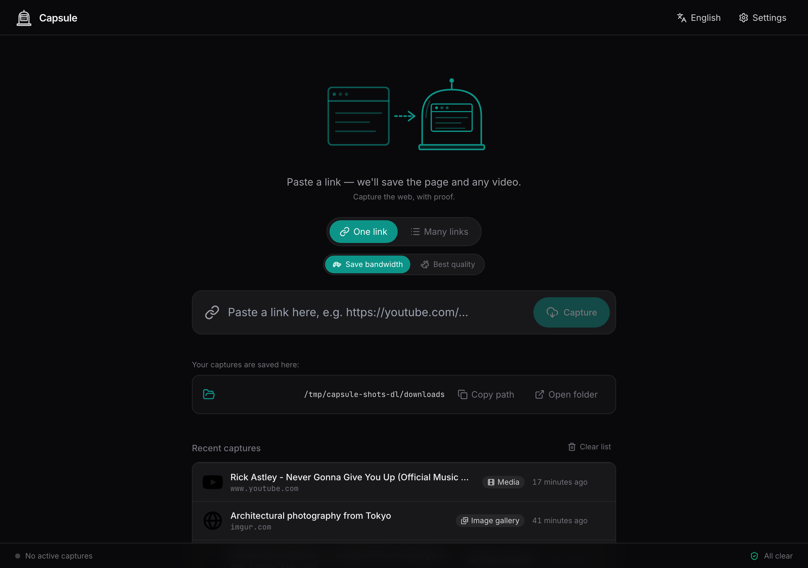
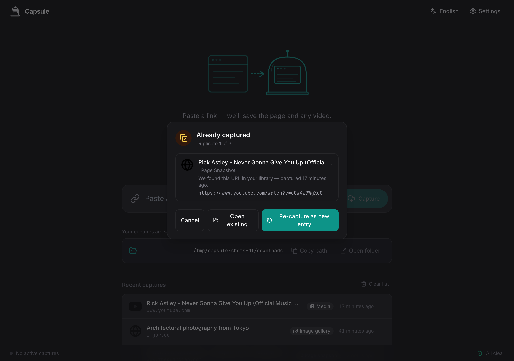
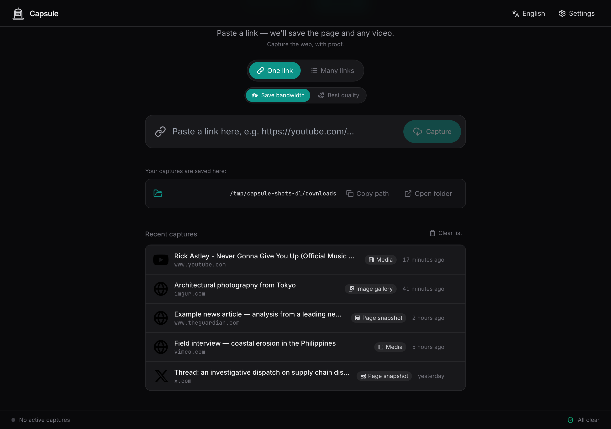
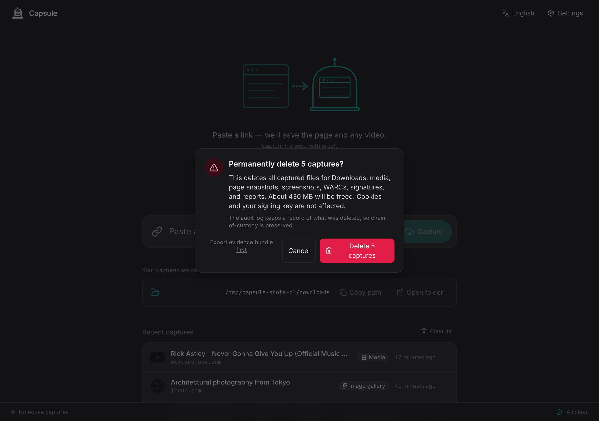
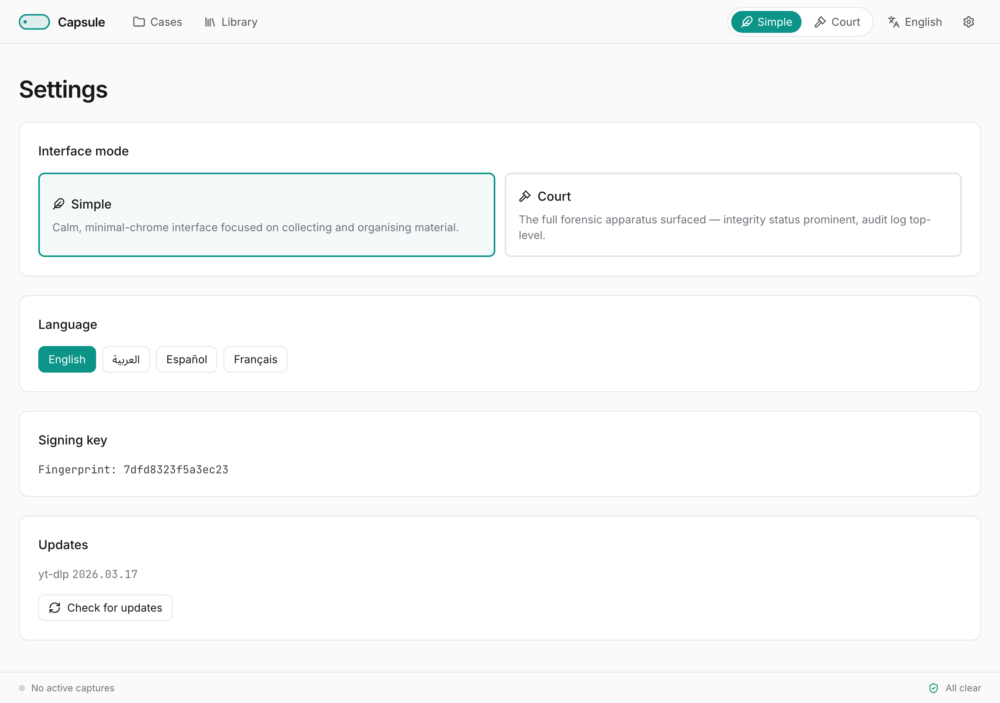

# Capsule User Guide

*Capture the web, with proof.*

This guide walks through every feature of Capsule — what it does, why it does it, and how to use it well. If you only need to get started, see the **Quick Start** instead.

---

## 1. What Capsule is for

Capsule is for investigators — researchers, journalists, lawyers, and discovery practitioners — who need to capture online material in a way that holds up to later scrutiny. The tool answers four questions for every item you save:

1. **Where did this come from?** The original URL, the redirect chain, the response headers, the platform.
2. **When was it captured?** UTC timestamp, on a tamper-evident audit trail.
3. **Is it intact?** MD5 and SHA-256 hashes of every file, plus a cryptographic signature.
4. **Who captured it?** The fingerprint of your signing key.

Capsule does not replace careful evidence handling — but it removes the most common reasons captures get challenged: unknown provenance, unclear timing, no integrity check, no signature.

---

## 2. What the v1 interface shows

The whole app, in v1, is a single **downloader** screen plus a **Settings** panel. Paste a URL (or a list), watch the four-phase progress strip, and find the result in the recent-captures list below the form. That's it for the UI.



The forensic machinery — case-grouped folders, cookies-per-case, the hash-chained audit log, signed evidence-export bundles — still runs for every capture. It is reachable through the host filesystem (`~/Documents/Capsule/`) and over the API. Sections 3-7 below describe **what's on disk** and **how to use the API** when you need any of those things.

Two interactive flows landed in v0.4 and live on the home view: paste-time **duplicate detection** (an "Already captured" modal that intercepts URLs you've already saved in this case) and a **Clear list** button at the top of the recent-captures list (gated by a destructive-action confirmation that also offers to export an evidence bundle first).

---

## 3. Cases

A case is one investigation. It owns its captures, its cookies, and its slice of the audit log. On disk, each case is its own folder under `~/Documents/Capsule/{case-slug}/`.

### How cases work in v1

Cases are first-class on the backend (filesystem, database, audit log) but **have no v1 UI**. Fresh installs use the slug `downloads` — every capture lands in `~/Documents/Capsule/downloads/`. (Existing installs that pre-date the rename keep the legacy `quick-captures` slug indefinitely so their evidence chains stay intact.)

If you need additional cases — for example, one folder per investigation — create them via the API:

```
POST /api/cases       { "name": "Plaza Square documentation" }
GET  /api/cases       → list every case with its slug + status
```

The slug is generated from the name, sanitized to be safe on every filesystem (Windows NTFS rules apply to Mac too, so a library moves between machines without surprises). The downloader still submits to the default case; switch the active case from the API by passing `case_id` to `POST /api/jobs/batch`.

---

## 4. Capturing a link

On the home view, paste a URL into the input field and press **Capture**. For multiple URLs, switch to the **Many links** tab, paste one per line, and press **Capture all**.

What Capsule does, in order:

1. **Classify the URL.** Resolves redirects, identifies the platform (YouTube, Twitter/X, TikTok, Pixiv, Imgur, …), and checks whether the case has cookies for the domain.
2. **Snapshot the page.** A full-page screenshot, an MHTML self-contained snapshot, and a WARC archive of the page plus every sub-resource it loaded.
3. **Download the media** if any — video, audio, or every image of an image gallery — using yt-dlp (videos) and gallery-dl (image-first sites) under the hood.
4. **Hash and sign.** Every file gets MD5 and SHA-256 hashes, the locale-aware manifest and report PDFs are written, then the metadata record is signed with your Ed25519 key.

You see four icons light up as each phase completes: globe (page), download cloud (media), hash mark (verify), shield with check (sign).

### Duplicate detection (v0.4)

Before any of that work runs, Capsule probes your library for a matching URL via `POST /api/jobs/preflight`. If it finds one, the **Already captured** modal opens in seconds — no wasted snapshot or download.



The modal offers three buttons:

- **Open existing** — reveals the saved item's folder. Logs `duplicate.opened_existing` in the audit log.
- **Re-capture as new entry** — runs the capture pipeline anyway. The new entry's stem gets a `__c2` / `__c3` suffix so both copies sit side-by-side, and `meta.json.force_recapture_index` records the index. Logs `duplicate.recaptured` with `original_id` and `new_id`.
- **Cancel** — drops the URL. Logs `duplicate.cancelled`.

For a paste with several duplicates, the modal queues them and shows a **"1 of N"** indicator at the top so you know how many decisions are left. The probe uses a canonical URL form (lowercased host, sorted query keys, tracking params stripped) so `?utm_source=email` and `?utm_source=tweet` collapse to the same dedup key. The originals (`url_submitted`, `url_final`) are still preserved verbatim in `meta.json`.

### Capture kinds

Every URL produces a snapshot package. What else gets saved alongside it determines the kind:

- **Media + page** — yt-dlp extracted a video, audio, or single image.
- **Image gallery + page** — yt-dlp found nothing, but gallery-dl extracted a multi-image set (Pixiv, DeviantArt, Imgur, Twitter image threads, Instagram carousels, Reddit galleries, Tumblr, ArtStation, Patreon, Fanbox, Flickr).
- **Page only** — neither extractor found media. The page snapshot is still saved, hashed, and signed.

A failed media or gallery download is **not** a failed capture. The page snapshot package is preserved.

### Download options (v0.7)

A **Download options** disclosure between the URL form and the active-jobs panel exposes three knobs that modify what yt-dlp does. Closed by default — captures stay paste-and-go unless you open it. Preferences persist in `localStorage` and apply to every URL submitted from the form until you change them.

- **Audio only** — extract just the audio stream and skip the video. The page snapshot (MHTML / PNG / WARC) still preserves the full video player from capture time, so the forensic record is unchanged. The choice is recorded in `meta.json.download_options.audio_only` and surfaces as a **Download options** section in the per-item report PDF, so a recipient is never left wondering why the on-disk media is `.mp3` while the screenshot shows a video.
- **Quality** — Best / Up to 1080p / Up to 720p / Up to 480p / Audio. Maps to yt-dlp's `--format bestvideo[height<=N]+bestaudio/best[height<=N]`; **Best** lifts any case-level cap. Recorded in `meta.json.download_options.quality_cap`.
- **Subtitles** — multi-select language chips (English, 日本語, العربية, Español, Français, Deutsch, 中文, Português, plus **All languages**). Saved as `.vtt` sidecars next to the media file via yt-dlp's `--write-subs --sub-langs <csv>`.

These are **download choices**, not post-capture mutations: the bytes yt-dlp writes are the same bytes the source served. The page snapshot is unaffected by any of these knobs.

### Pausing, resuming, restarting, cancelling (v0.7)

Each active-job card has an icon-only toolbar with translated `aria-label`s:

- **Pause** halts the current download mid-flight; the partial bytes are kept so **Resume** can pick up where it stopped (yt-dlp's `--continue` is the default).
- **Restart** wipes any `*.part` / `*.ytdl` files and starts the capture over from clean bytes. Distinct from **Resume** — use it when the partial download seems corrupted, or when you specifically want forensically clean bytes. Logs `job.restarted` and bumps `meta.json.download_options.restart_count`. Any auto-retry after a transient failure goes back to `--continue`.
- **Cancel** terminates the job and discards partial files. The page snapshot, if it already saved, is preserved.

**Cancel** and **Restart** route through a destructive-action confirmation dialog (the same shape as the v0.4 clear-list dialog). **Pause** and **Resume** click straight through — they're reversible.

### Stalled captures (v0.7)

A watchdog wakes about every five seconds. If a job goes 90 s with no progress output from yt-dlp, an amber **Stalled — no progress for N s** chip appears on the job card. The chip clears the moment progress resumes — there is **no automatic kill**. Stalls are a UI signal, not a kill condition.

The audit log records `download.stalled` when the chip appears and `download.stall_cleared` when progress comes back. The per-job stall count rides into `meta.json.capture.stalled_count` and `meta.json.download_options.stalled_count`, so a recipient can see exactly how many stalls a given capture survived.

If a stall persists, use the toolbar — **Cancel** for "give up" or **Restart** for "wipe and retry."

---

## 5. The capture package

For every item, Capsule writes a self-contained per-item folder:

```
~/Documents/Capsule/downloads/
└── youtube__veritasium__The_Most_Stubbornly_…__abc123XYZ/
    ├── youtube__veritasium__…__abc123XYZ.report.pdf       ← human-readable
    ├── youtube__veritasium__…__abc123XYZ.manifest.pdf     ← full hashes
    ├── Captures/
    │   ├── youtube__veritasium__…__abc123XYZ.page.mhtml
    │   ├── youtube__veritasium__…__abc123XYZ.page.png
    │   └── youtube__veritasium__…__abc123XYZ.page.warc.gz
    ├── Media/
    │   ├── youtube__veritasium__…__abc123XYZ.mp4          ← media file
    │   └── youtube__veritasium__…__abc123XYZ.thumbnail.jpg
    └── Metadata/
        ├── youtube__veritasium__…__abc123XYZ.meta.json
        ├── youtube__veritasium__…__abc123XYZ.meta.json.sig
        ├── youtube__veritasium__…__abc123XYZ.checksums.txt
        ├── youtube__veritasium__…__abc123XYZ.info.json    ← yt-dlp metadata
        └── youtube__veritasium__…__abc123XYZ.description.txt
```

The canonical filename pattern for media items is `{platform}__{uploader}__{title}__{date}__{video_id}.{ext}`, sanitized for cross-platform portability.

The `checksums.txt` sidecar uses the standard `md5sum -c` / `sha256sum -c` format — drop into a terminal, run the verification command, see PASS/FAIL line by line.

### Image-gallery layout

Image-gallery captures share the same per-item folder layout but replace the single media file with a numbered image set, plus a gallery-level metadata sidecar:

```
└── pixiv__user__series_title__dl-2026-05-07__a1b2c3d4e5f6/
    ├── …report.pdf             ← human-readable + thumbnail strip (up to 20 thumbs)
    ├── …manifest.pdf           ← every image listed with full hashes
    ├── Captures/               ← page.mhtml, page.png, page.warc.gz
    ├── Media/
    │   ├── …001.jpg            ← image #1
    │   ├── …002.png
    │   └── …                   ← (up to gallery_max_items)
    └── Metadata/
        ├── …001.json           ← gallery-dl per-image metadata
        ├── …002.json
        ├── …gallery_info.json  ← gallery-level metadata
        ├── …meta.json          ← canonical record (incl. gallery_count, gallery_extractor)
        ├── …meta.json.sig
        └── …checksums.txt
```

Each image gets its own MD5 + SHA-256, and the whole set is bound by the canonical `meta.json.sig` — a single signature covers every image.

The original, untruncated title and URL live in `meta.json` — never lost.

### The two per-item PDFs

Every capture writes two locale-aware PDFs at the top of the per-item folder, so a recipient sees them first:

- **`{stem}.manifest.pdf`** — A4 landscape, verifier-ready file table with **full** untruncated MD5 (32 hex) + SHA-256 (64 hex) for every file in the per-item folder. Header carries the source URL, capture timestamp UTC, and the signing-key fingerprint.
- **`{stem}.report.pdf`** — Human-readable companion: provenance (URLs, redirect chain, captured-at UTC, uploader, upload date, duration, authenticated domains), the full untruncated description (paginated), a tools-and-versions table, and a capture-side report (render-wait outcomes, blocked-request count, banner-hide flags, readiness, report locale, animations frozen for the screenshot, browser console message and error counts, media-context screenshot status, WARC session provenance — single-session CDP→WARC vs. browsertrix-crawler subprocess fallback — and a screenshot-truncation note for very tall pages). When any non-default download knob was in effect — audio only, quality cap, subtitles, restart count, stall count — a **Download options** section is added so a recipient can see exactly which choices shaped this capture. For galleries, also a thumbnail strip of up to 20 images.

Both PDFs render in whichever UI language was active when the capture was submitted (`en`, `ar`, `ja`, `es`). Both files are referenced by hash in `meta.json` and are therefore transitively signed by `meta.json.sig` — no extra signing path needed.

---

## 6. Cookies and authenticated capture

Some content is only visible when signed in: private accounts, age-gated videos, paywalled articles, member-only forums, image galleries on Pixiv / DeviantArt / Patreon / Fanbox. Capsule supports this two ways:

### Recommended: the Capsule browser extension

Pair the Capsule extension (Settings → Browser extension), then click **Send this tab** or **Sync cookies** in the extension popup. The extension can read **HttpOnly** cookies and partitioned third-party cookies that the page itself cannot expose, and it iterates every cookie store (default + container + partitioned) so multi-account workflows work.

### Fallback: upload a cookies.txt file

Export cookies from the browser using a Netscape-format cookies.txt extension, then upload via:

```
POST /api/cookies                multipart with file=cookies.txt&case_slug=downloads
```

Both paths land at the same Netscape file under `/config/cases/{case-slug}/cookies.txt`. Only the domain list and expiry dates are surfaced; **cookie values themselves are never displayed, never logged, and never included in evidence exports.**

### Ephemeral (one-shot) cookies

The extension popup exposes a per-submission **Ephemeral cookies** toggle. When set, cookies ride to the backend in a per-job tmpdir, are used by Playwright (page + in-session WARC), yt-dlp, and gallery-dl for that single job, and are discarded after the job ends — never written to the case directory. The audit log records `cookies.ephemeral_used` with the snapshot hash, never values.

### Auto-attach for known sites

When you submit a URL whose domain matches your stored cookies, Capsule shows an **Authenticated as {domain}** chip on the capture preview and passes the cookies to every downstream tool — Playwright (page snapshot), yt-dlp (video/audio), and gallery-dl (image galleries) — so the snapshot, the media, and the gallery all come from the same authenticated session.

The auto-attach domain list covers the major social and image-first sites: Twitter/X, Facebook, Instagram, TikTok, LinkedIn, Reddit, YouTube (private/age-gated), Threads, Pixiv, DeviantArt, Tumblr, Flickr, Imgur, Patreon, ArtStation, Fanbox.

At job start, the backend hashes the cookie file (`cookies_snapshot_sha256`, recorded in `meta.json` and the audit log) and reports any expired or expiring-soon domains. Stale cookies are still attached, but the audit log gets a `cookies.stale_at_capture` entry.

---

## 7. The recent-captures list

The home view's recent-captures list is the v1 surface for browsing what you've saved.



Each row shows the platform icon, the title (single line, ellipsized, RTL-safe via `<bdi>`), the source URL host on a secondary line, a capture-kind chip (Media / Image gallery / Page snapshot), an integrity hint, and a relative time. Hover a row to reveal the **Open folder** action.

### Clearing the list

The **Clear list** button at the top of the list deletes every per-item folder for the active case, drops the `downloads` rows, and cascades orphaned `capture_groups`. The case row itself, the case directory, the case's `cookies.txt`, your signing key, and **every** prior `audit_log` row are preserved. The audit log gets a single rolled-up `library.cleared` row with a snapshot per deleted item (id, url_hash, capture_date, media SHA-256, meta.json SHA-256) — the chain-of-custody anchor for the deletion event.

A destructive-action confirmation dialog gates the call:



The dialog tells you exactly what will be removed, estimates the freed bytes, reminds you the audit log keeps a record, and offers an **Export evidence bundle first** button so you can hand off the bundle before wiping the originals.

### Reading the broader library

For anything beyond the recent-captures list — bulk filtering, full-library inventory, integration with other tools — go through the API or the on-disk folders:

```
GET /api/library                        list every capture (paginated)
GET /api/library/export?format=csv      RFC 4180 CSV of every row
GET /api/library/export?format=json     JSON, includes meta_json
```

The CSV is the easiest input for spreadsheets and case-management tools; the JSON dump is what other forensic pipelines should ingest.

---

## 8. Integrity verification

Every artifact is hashed and the metadata record is signed. To re-check at any time:

- **Single item:** run `verify.py` against the per-item folder (the script is bundled inside every evidence-export, but you can also run it standalone — see §14 below).
- **Whole library:** call `POST /api/library/verify`. Returns a per-item PASS/FAIL with the diff (which file's hash differs, expected hash, observed hash, signature failure reason).
- **A bundle you received:** every evidence export ships with a self-contained `verify.py` script you run with no dependencies beyond `cryptography`.

A failed verification gives you the actual diff, not a generic "integrity error" — so you know exactly which file or signature broke.

---

## 9. The audit log

Every state-changing operation — case created, capture started, page captured, media downloaded, signature created, item verified, case exported — is recorded in an append-only, hash-chained log. Each entry includes its predecessor's hash. If a row is altered, the chain breaks at that row and you can identify exactly where.

The audit log is **not surfaced in the v1 UI**. It is always written and is reachable via `GET /api/audit` and as `audit_log.json` inside every evidence-export bundle.

The v0.4 through v0.7 releases added several new audit actions worth noting:

- **Duplicate detection (v0.4):** `duplicate.detected` (preflight match, before user choice), `duplicate.opened_existing`, `duplicate.recaptured` (with `original_id` and `new_id`), `duplicate.cancelled`.
- **Clear-list (v0.4):** `library.cleared` — single rolled-up snapshot row preserving id, url_hash, capture_date, media SHA-256, meta.json SHA-256 per deleted item. The case row, case directory, cookies, signing key, and prior audit rows are untouched.
- **Image galleries (v0.5):** `gallery.started` (every gallery-dl invocation) followed by exactly one outcome — `gallery.captured` (with `image_count` and `extractor`), `gallery.empty`, `gallery.rate_limited`, `gallery.auth_required`, or `gallery.failed`.
- **Page-preservation hardening (v0.6):** `capture.warc_session_in_process` / `capture.warc_session_subprocess` (which WARC writer ran), `capture.animations_frozen` (CSS-only animation freeze applied right before the screenshot), `capture.media_context_captured` (a viewport-sized screenshot framed on the page's primary video element), `capture.console_messages_recorded` (browser console + page errors saved as a sidecar), `capture.screenshot_truncated` (very tall page, screenshot capped at 30,000 px while MHTML and WARC stay complete), `capture.readiness_budget_exceeded` (the 60 s render-wait outer budget tripped, remaining gates skipped).
- **Download controls (v0.7):** `download.options_applied` (logged at dispatch when any knob is non-default), `download.stalled` / `download.stall_cleared` (no progress for 90 s, then resumed), `job.restarted` (clean-byte restart, distinct from auto-retry), plus the existing `job.paused` / `job.resumed` / `job.cancelled` from the per-job toolbar.

---

## 10. Evidence export

When you're ready to hand off, trigger the export from the API:

```
POST /api/cases/{id}/export?lang=en       → signed zip + locale-aware PDF
```

The bundle is a single zip file containing:

- A `manifest.json` listing every file with role, size, MD5, SHA-256.
- `manifest.sig` — your detached Ed25519 signature of the manifest.
- `public_key.pem` — so the recipient can verify.
- A locale-aware **PDF case report** (RTL-correct for Arabic).
- `audit_log.json` — full audit-log entries for this case.
- `verify.py` — the standalone verifier (only `cryptography` dependency).
- A `downloads/` tree mirroring the on-disk per-item folder layout exactly: every `{stem}/` directory holds the two PDFs (`{stem}.report.pdf` + `{stem}.manifest.pdf`) at the root, plus the `Captures/`, `Media/`, and `Metadata/` subfolders with the page-snapshot trio (`mhtml`/`png`/`warc.gz`), media file (when present), and `meta.json` + `.sig` + `checksums.txt`.

The recipient runs `python verify.py path/to/bundle/` and gets a PASS/FAIL report. They do not need to install Capsule.

---

## 11. Updates

Capsule never auto-updates and never polls for updates silently. You decide when.

In **Settings → Updates**, click **Check for updates**. Capsule makes a single GitHub API call and tells you what's available for both yt-dlp and gallery-dl (the two updateable runtime components). If you say yes, the new version installs inside the container; the audit log records `system.updated` with the component label.

Behind the scenes:

```
GET  /api/system/version                              → app, yt_dlp, gallery_dl, chromium, browsertrix
POST /api/system/update?component=yt-dlp              upgrade yt-dlp
POST /api/system/update?component=gallery-dl          upgrade gallery-dl
```

If a capture fails with the kind of error that usually means a downloader is out of date (yt-dlp's "extractor outdated", gallery-dl's "rate-limited"/"auth-required"), the failure card surfaces a contextual **Check for updates** button.

---

## 12. Settings



The Settings panel is the second of the v1 UI's two surfaces. Four cards:

- **Language** — English, Arabic, Japanese, Spanish. Switch any time; no reload. The active locale also drives every per-item PDF rendered while it's set.
- **Signing key** — view your fingerprint. (Existing items keep their original signatures regardless of any future key change; key import is supported via the API but not surfaced as a v1 UI button.)
- **Browser extension** — the recommended cookie path. **Pair a new extension** mints a token shown exactly once. Below that, an in-app install accordion walks you through loading the extension into Chrome / Edge / Brave / Firefox. The paired-list shows label + last-used-at + a **Revoke** button. Token rotation is available via `POST /api/extension/pair/{token_id}/rotate` (issues a fresh token and revokes the prior one in a single call).
- **Updates** — manual check, see §11.

---

## 13. Troubleshooting

- **The launcher says Docker isn't running.** Open Docker Desktop from Applications (macOS) or the Start menu (Windows) and wait for it to finish starting.
- **The launcher says port 8080 is already in use.** Stop whatever is using port 8080, or edit the launcher to use a different port (`-p 9090:8080`).
- **A capture failed.** Click **Show technical details** on the error card. It includes the URL, the timestamp, every tool's version, and the full error output — paste it into a bug report.
- **A site blocks me.** Try uploading cookies for that site (see §6) and re-capturing.
- **The site rate-limits me.** Wait a few minutes and click **Try again**.
- **"No images found on this page."** The page didn't have any images gallery-dl could extract; the page snapshot is still saved as a `page_only` capture.
- **A capture is stuck.** An amber **Stalled** chip means the job hasn't made progress for 90 s but isn't dead — Capsule never auto-kills. Use the per-job toolbar: **Pause** then **Resume** to nudge, **Restart** for forensically clean bytes, or **Cancel** to give up.
- **The download is huge or slow.** Open **Download options** above the active-jobs panel and cap quality at **720p**, or pick **Audio only** for podcasts and lectures. The page snapshot is captured at full fidelity regardless.

---

## 14. For recipients of evidence bundles

If someone has sent you a Capsule export, you can verify everything without installing Capsule:

1. Unzip the bundle.
2. Open a terminal in the bundle folder.
3. Run `python verify.py .`
4. Read the report. PASS means every file matches the manifest, every signature is valid, and the audit-log chain is intact. FAIL identifies exactly what doesn't match.

The signed PDF case report inside the bundle is human-readable and locale-aware — Arabic readers get a right-to-left report, English readers get the same content left-to-right.
